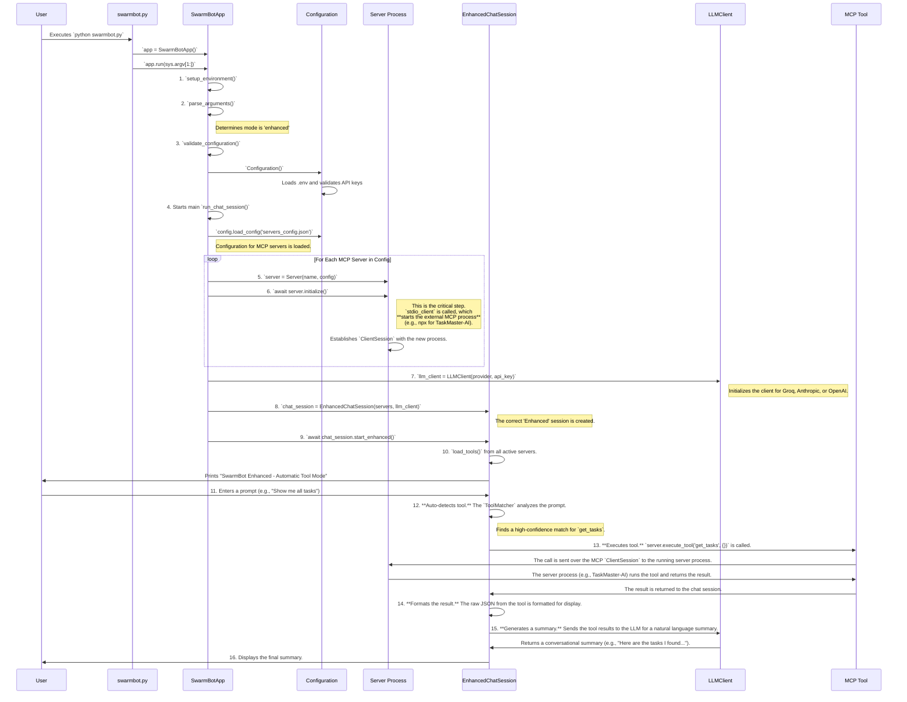

```mermaid
sequenceDiagram
    participant User
    participant CLI as swarmbot.py
    participant App as SwarmBotApp
    participant Config as Configuration
    participant Server as Server Process
    participant Session as EnhancedChatSession
    participant LLM as LLMClient
    participant Tool as MCP Tool

    User->>CLI: Executes `python swarmbot.py`
    CLI->>App: `app = SwarmBotApp()`
    CLI->>App: `app.run(sys.argv[1:])`

    App->>App: 1. `setup_environment()`
    App->>App: 2. `parse_arguments()`
    Note right of App: Determines mode is 'enhanced'

    App->>App: 3. `validate_configuration()`
    App->>Config: `Configuration()`
    Config->>Config: Loads .env and validates API keys

    App->>App: 4. Starts main `run_chat_session()`
    App->>Config: `config.load_config('servers_config.json')`
    Note right of App: Configuration for MCP servers is loaded.

    loop For Each MCP Server in Config
        App->>Server: 5. `server = Server(name, config)`
        App->>Server: 6. `await server.initialize()`
        Note right of Server: This is the critical step.<br/>`stdio_client` is called, which<br/>**starts the external MCP process**<br/>(e.g., npx for TaskMaster-AI).
        Server->>Server: Establishes `ClientSession` with the new process.
    end

    App->>LLM: 7. `llm_client = LLMClient(provider, api_key)`
    Note right of LLM: Initializes the client for Groq, Anthropic, or OpenAI.

    App->>Session: 8. `chat_session = EnhancedChatSession(servers, llm_client)`
    Note right of Session: The correct 'Enhanced' session is created.

    App->>Session: 9. `await chat_session.start_enhanced()`
    Session->>Session: 10. `load_tools()` from all active servers.
    Session->>User: Prints "SwarmBot Enhanced - Automatic Tool Mode"

    User->>Session: 11. Enters a prompt (e.g., "Show me all tasks")

    Session->>Session: 12. **Auto-detects tool.** The `ToolMatcher` analyzes the prompt.
    Note right of Session: Finds a high-confidence match for `get_tasks`.

    Session->>Tool: 13. **Executes tool.** `server.execute_tool('get_tasks', {})` is called.
    Tool->>Server: The call is sent over the MCP `ClientSession` to the running server process.
    Server->>Tool: The server process (e.g., TaskMaster-AI) runs the tool and returns the result.
    Tool->>Session: The result is returned to the chat session.

    Session->>Session: 14. **Formats the result.** The raw JSON from the tool is formatted for display.

    Session->>LLM: 15. **Generates a summary.** Sends the tool results to the LLM for a natural language summary.
    LLM->>Session: Returns a conversational summary (e.g., "Here are the tasks I found...").

    Session->>User: 16. Displays the final summary.

```