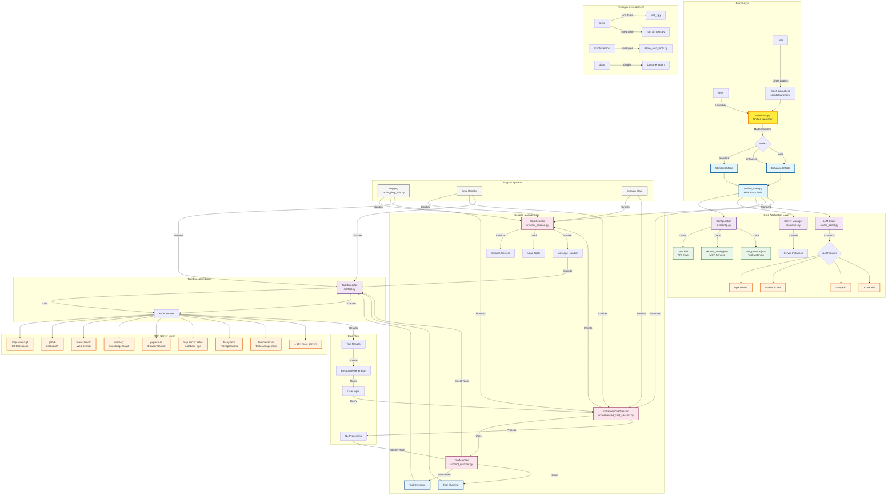

# SwarmBot Workflow Diagram

## Complete System Architecture and Workflow

## Workflow Description

### 1. Entry Flow
- User launches via `swarmbot.py` (unified launcher) or batch files
- Selects mode: Standard or Enhanced
- Launcher starts `unified_main.py` with mode parameter

### 2. Initialization Flow
1. Configuration loads environment variables and config files
2. Server Manager creates MCP server instances
3. LLM Client connects to selected provider
4. Chat Session initializes based on mode

### 3. Standard Mode Flow
- User provides explicit tool commands
- ChatSession parses and executes
- Direct tool invocation
- Results returned to user

### 4. Enhanced Mode Flow
- Natural language input from user
- EnhancedChatSession processes with ToolMatcher
- Automatic tool detection and selection
- Tool chaining for complex tasks
- Natural language response generation

### 5. Tool Execution Flow
1. Tool selected (manually or automatically)
2. Parameters extracted/generated
3. MCP server called
4. Results processed
5. Response formatted

### 6. Error Handling Flow
- All operations wrapped in try-catch
- Graceful degradation on server failures
- User-friendly error messages
- Detailed logging for debugging

## Key Components

### Entry Points
- **swarmbot.py**: Main launcher with interactive mode selection
- **unified_main.py**: Combined entry point for both modes
- **Batch files**: Windows convenience launchers

### Core Modules
- **config.py**: Central configuration management
- **server.py**: MCP server connection handling
- **llm_client.py**: Multi-provider LLM interface
- **tool.py**: Tool abstraction and execution

### Session Handlers
- **chat_session.py**: Standard mode conversation handling
- **enhanced_chat_session.py**: Enhanced mode with auto-tools
- **tool_matcher.py**: Natural language to tool mapping

### Support Systems
- **logging_utils.py**: Filtered logging system
- Error handling throughout
- Session persistence capabilities

### MCP Servers (20+ integrated)
- Development: git, github, taskmaster-ai
- Search: brave-search, exa
- Browser: puppeteer, browsermcp
- System: filesystem, desktop-commander
- Data: sqlite, memory (knowledge graph)
- AI: sequential-thinking, code-reasoning
- And many more...
