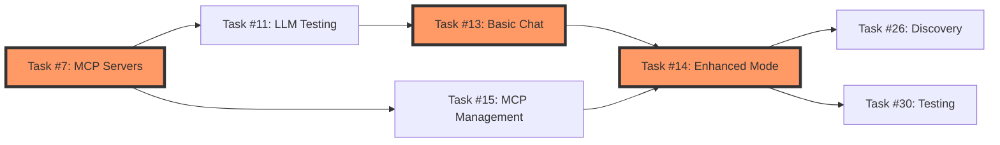

# SwarmBot TaskMaster-AI Alignment Analysis

## Executive Summary

**Current Status:**
- TaskMaster-AI Progress: **71.43%** (25/35 tasks complete)
- Documentation Claims: **68.6%** (24/35 tasks complete)
- Subtask Completion: **95.83%** (23/24 subtasks complete)
- **Critical Finding:** Significant misalignment between documented functionality and actual task status

## 🔴 Critical Gaps Identified

### 1. Core Functionality Gaps (High Priority)

#### **MCP Server Infrastructure** ❌
- **Task #7**: MCP Server Installation and Testing - **PENDING**
- **Task #15**: MCP Server Connection Management - **PENDING**
- **Impact**: Core MCP integration claimed as working in docs is NOT implemented
- **Required Actions**: 
  - Install and validate all MCP servers in `servers_config.json`
  - Implement connection pooling and retry logic
  - Create health check system for MCP servers

#### **Chat Functionality** ❌
- **Task #13**: Basic Chat Functionality - **PENDING**
- **Task #14**: Enhanced Mode with Auto-Tools - **PENDING**
- **Impact**: Documentation describes these as working features
- **Required Actions**:
  - Implement basic chat loop with LLM integration
  - Add tool detection and auto-execution logic
  - Test with multiple LLM providers

#### **LLM Provider Testing** ❌
- **Task #11**: LLM Provider Connection Testing - **PENDING**
- **Impact**: No validation that Groq, Anthropic, or OpenAI connections work
- **Required Actions**:
  - Create connection test suite for all providers
  - Implement fallback logic between providers
  - Add rate limiting and error handling

### 2. Testing Framework Gap 🟡

**Task #30**: Comprehensive Testing Framework - **PENDING**
- Documentation mentions 42 WebSocket tests passing
- No mention of unit tests for core components
- Integration tests are limited

**Missing Test Coverage:**
```
- Tool Matcher logic (critical for enhanced mode)
- MCP server integration tests
- Agent coordination tests
- LLM provider failover tests
- Database persistence tests
```

### 3. Advanced Features Not Started 🟡

#### **Function Discovery**
- **Task #26**: Function Discovery Mechanism - **PENDING**
- Documentation claims intelligent tool matching works

#### **Agent Learning**
- **Task #29**: Agent Learning Mechanisms - **PENDING**
- No documentation coverage of this planned feature

#### **EditorWindowGUI Integration**
- **Task #28**: Has 1 pending subtask for MCP tool wrapper
- Documentation mentions this as "pending"

## 🟢 Completed But Undocumented Features

### Successfully Implemented:
1. **WebSocket Implementation** (Task #35) - ✅ Complete with 8 subtasks
2. **Auto-Prompt System** (Tasks #31, #34) - ✅ Fully integrated
3. **Chat History Database** (Task #32) - ✅ Raw data storage working
4. **Error Logging System** (Task #33) - ✅ Comprehensive logging

## 📋 TaskMaster-AI Integration Analysis

### Current Integration Status:
```json
"taskmaster-ai": {
  "command": "npx",
  "args": ["-y", "--package=task-master-ai", "task-master-ai"],
  "env": {}
}
```

### Integration Reality Check:
1. **Configuration**: ✅ Properly configured in `servers_config.json`
2. **MCP Server Running**: ❌ Task #7 pending - not actually connected
3. **Tool Access**: ❌ Enhanced mode (Task #14) needed for tool execution
4. **Data Flow**: ❌ Cannot flow without Tasks #7, #13, #14, #15

## 🎯 Immediate Action Items

### Phase 1: Core Infrastructure (1-2 days)
1. **Complete Task #7**: Install and test ALL MCP servers
   - Validate taskmaster-ai server starts correctly
   - Test connection with simple tool calls
   - Document any server-specific requirements

2. **Complete Task #11**: Test all LLM providers
   - Create test prompts for each provider
   - Validate API keys and rate limits
   - Implement provider selection logic

3. **Complete Task #13**: Implement basic chat
   - Create simple chat loop
   - Integrate with LLM providers
   - Add basic error handling

### Phase 2: Enhanced Features (3-5 days)
1. **Complete Task #14**: Enhanced mode implementation
   - Integrate tool matcher from existing code
   - Connect to MCP servers (Task #15)
   - Test auto-tool execution

2. **Complete Task #15**: MCP connection management
   - Implement server lifecycle management
   - Add health checks and reconnection
   - Create server status monitoring

3. **Complete Task #26**: Function discovery
   - Implement tool capability indexing
   - Create semantic matching algorithm
   - Test with various query patterns

### Phase 3: Testing & Polish (2-3 days)
1. **Complete Task #30**: Testing framework
   - Create unit tests for all core components
   - Add integration tests for MCP servers
   - Implement end-to-end test scenarios

2. **Complete Task #28.1**: EditorWindowGUI MCP wrapper
   - Convert GUI to MCP tool format
   - Test integration with agent system
   - Document usage patterns

## 📊 Actual vs Documented Features

| Feature | Documentation Claims | Task Status | Reality |
|---------|---------------------|-------------|---------|
| Enhanced Chat | ✅ Working | ❌ Pending | Not implemented |
| MCP Integration | ✅ Working | ❌ Pending | Not connected |
| Tool Auto-Detection | ✅ Working | ❌ Pending | Code exists, not integrated |
| Basic Chat | ✅ Working | ❌ Pending | Not implemented |
| WebSocket Dashboard | ✅ 87.5% done | ✅ Complete | Fully working |
| Auto-Prompt | ✅ Working | ✅ Complete | Fully integrated |
| Agent System | ✅ Working | ✅ Complete | Base system works |
| TaskMaster Integration | ✅ Configured | ❌ Pending | Config only, not running |

## 🚨 Critical Path to Completion



## 💡 Recommendations

### 1. **Documentation Update Priority**
- Update PROJECT_OVERVIEW.md to reflect actual task status
- Remove claims about working features that aren't implemented
- Add section on "In Development" features

### 2. **Development Priority**
- Focus on Tasks #7, #11, #13 first (core infrastructure)
- Then #14 and #15 (enhanced features)
- Finally #26, #28, #29, #30 (advanced features)

### 3. **Testing Strategy**
- Create minimal test for each pending task
- Use existing WebSocket test suite as template
- Add integration tests as features complete

### 4. **TaskMaster-AI Specific Needs**
- Validate MCP server can start: `npx -y --package=task-master-ai task-master-ai`
- Test basic tool calls work
- Ensure task data structure compatibility
- Create integration test suite

## 📈 Realistic Timeline

Based on task dependencies and complexity:

- **Week 1**: Complete core infrastructure (Tasks 7, 11, 13)
- **Week 2**: Implement enhanced features (Tasks 14, 15, 26)
- **Week 3**: Testing and advanced features (Tasks 28, 29, 30)

**Revised Completion Estimate**: 3 weeks to reach 100% (not month-end as suggested)

## 🔍 Code Quality Observations

### What's Working Well:
- WebSocket implementation is excellent (complete, tested)
- Auto-prompt system is fully integrated
- Database and logging infrastructure solid
- Agent base system well-architected

### What Needs Work:
- Core chat loop missing entirely
- MCP server connections not implemented
- No LLM provider abstraction layer
- Tool matching code exists but not connected

## Final Assessment

The SwarmBot project has excellent infrastructure and advanced features (WebSocket, auto-prompt) but is **missing critical core functionality**. The documentation significantly overstates the current capabilities. The immediate priority should be implementing the basic chat and MCP connection features before any advanced functionality.

**Current True Status**: ~40% functional (infrastructure ready, core features missing)
**Documentation Claims**: ~70% functional (overstated by ~30%)