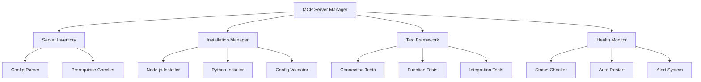

# MCP Server Installation and Testing - Implementation Document

## Table of Contents
1. [Executive Summary](#executive-summary)
2. [Architecture Overview](#architecture-overview)
3. [Implementation Phases](#implementation-phases)
4. [Detailed Component Implementation](#detailed-component-implementation)
5. [Testing Procedures](#testing-procedures)
6. [Deployment Guide](#deployment-guide)
7. [Troubleshooting](#troubleshooting)
8. [Appendices](#appendices)

---

## Executive Summary

### Purpose
This document provides the complete implementation guide for Task 7: MCP Server Installation and Testing. This task is critical for the SwarmBot project as it establishes the foundation for multi-agent communication and orchestration.

### Scope
- Automated discovery and installation of MCP servers
- Comprehensive testing framework for server validation
- Health monitoring and automatic recovery systems
- Integration with existing SwarmBot infrastructure

### Dependencies
- Node.js 16+ and npm/npx
- Python 3.8+ with UV package manager
- Configured servers_config.json
- Network access for package installation

---

## Architecture Overview

### System Components



### Data Flow

```python
# Configuration Structure
{
    "servers": {
        "server_name": {
            "type": "nodejs|python",
            "command": "installation_command",
            "args": ["arg1", "arg2"],
            "env": {
                "KEY": "value"
            },
            "health_check": {
                "endpoint": "/health",
                "interval": 30,
                "timeout": 5
            }
        }
    }
}
```

---

## Implementation Phases

### Phase 1: Server Discovery and Inventory (2-3 hours)

#### 1.1 Create Server Inventory Module

**File: `src/mcp/server_inventory.py`**

```python
import json
import os
import subprocess
import sys
from pathlib import Path
from typing import Dict, List, Tuple, Optional
from dataclasses import dataclass
from enum import Enum

class ServerType(Enum):
    NODEJS = "nodejs"
    PYTHON = "python"
    UNKNOWN = "unknown"

@dataclass
class MCPServerInfo:
    name: str
    type: ServerType
    command: str
    args: List[str]
    env: Dict[str, str]
    health_check: Optional[Dict[str, any]]
    status: str = "unknown"
    
class MCPServerInventory:
    """Manages the inventory of MCP servers configured for SwarmBot"""
    
    def __init__(self, config_path: str = "config/servers_config.json"):
        self.config_path = Path(config_path)
        self.servers: Dict[str, MCPServerInfo] = {}
        self.prerequisites_cache = {}
        
    def scan_servers(self) -> Dict[str, MCPServerInfo]:
        """Scan and catalog all configured MCP servers"""
        if not self.config_path.exists():
            raise FileNotFoundError(f"Server config not found: {self.config_path}")
            
        with open(self.config_path, 'r') as f:
            config = json.load(f)
            
        for name, server_config in config.get('servers', {}).items():
            server_type = self._determine_server_type(server_config)
            
            self.servers[name] = MCPServerInfo(
                name=name,
                type=server_type,
                command=server_config.get('command', ''),
                args=server_config.get('args', []),
                env=server_config.get('env', {}),
                health_check=server_config.get('health_check'),
                status='not_installed'
            )
            
        return self.servers
    
    def _determine_server_type(self, config: Dict) -> ServerType:
        """Determine the type of MCP server from its configuration"""
        command = config.get('command', '').lower()
        
        if 'node' in command or 'npm' in command or 'npx' in command:
            return ServerType.NODEJS
        elif 'python' in command or 'uv' in command or 'pip' in command:
            return ServerType.PYTHON
        else:
            # Check file extension if command points to a file
            if Path(command).suffix in ['.js', '.mjs', '.ts']:
                return ServerType.NODEJS
            elif Path(command).suffix in ['.py']:
                return ServerType.PYTHON
                
        return ServerType.UNKNOWN
    
    def check_prerequisites(self, server_name: str) -> Tuple[bool, List[str]]:
        """Check if server prerequisites are met"""
        if server_name not in self.servers:
            return False, [f"Server '{server_name}' not found in inventory"]
            
        server = self.servers[server_name]
        missing = []
        
        # Check common prerequisites
        if server.type == ServerType.NODEJS:
            if not self._check_nodejs():
                missing.append("Node.js (16+ required)")
            if not self._check_npm():
                missing.append("npm package manager")
                
        elif server.type == ServerType.PYTHON:
            if not self._check_python():
                missing.append("Python 3.8+")
            if not self._check_uv():
                missing.append("UV package manager")
                
        # Check server-specific requirements
        specific_reqs = self._check_specific_requirements(server)
        missing.extend(specific_reqs)
        
        return len(missing) == 0, missing
    
    def _check_nodejs(self) -> bool:
        """Check if Node.js is installed and meets version requirements"""
        try:
            result = subprocess.run(['node', '--version'], 
                                  capture_output=True, text=True)
            if result.returncode == 0:
                version = result.stdout.strip()
                # Extract major version number
                major = int(version.split('.')[0].replace('v', ''))
                return major >= 16
        except:
            pass
        return False
    
    def _check_npm(self) -> bool:
        """Check if npm is installed"""
        try:
            result = subprocess.run(['npm', '--version'], 
                                  capture_output=True, text=True)
            return result.returncode == 0
        except:
            return False
    
    def _check_python(self) -> bool:
        """Check if Python 3.8+ is installed"""
        try:
            result = subprocess.run([sys.executable, '--version'], 
                                  capture_output=True, text=True)
            if result.returncode == 0:
                version = result.stdout.strip()
                # Extract version numbers
                parts = version.split()[1].split('.')
                major, minor = int(parts[0]), int(parts[1])
                return major == 3 and minor >= 8
        except:
            pass
        return False
    
    def _check_uv(self) -> bool:
        """Check if UV package manager is installed"""
        try:
            result = subprocess.run(['uv', '--version'], 
                                  capture_output=True, text=True)
            return result.returncode == 0
        except:
            return False
    
    def _check_specific_requirements(self, server: MCPServerInfo) -> List[str]:
        """Check server-specific requirements"""
        missing = []
        
        # Check for required environment variables
        for env_var in server.env.keys():
            if env_var.endswith('_API_KEY') or env_var.endswith('_TOKEN'):
                if not os.environ.get(env_var):
                    missing.append(f"Environment variable: {env_var}")
                    
        return missing
    
    def get_installation_order(self) -> List[str]:
        """Determine optimal installation order based on dependencies"""
        # For now, return alphabetical order
        # TODO: Implement dependency graph analysis
        return sorted(self.servers.keys())
    
    def update_server_status(self, server_name: str, status: str):
        """Update the status of a server"""
        if server_name in self.servers:
            self.servers[server_name].status = status
    
    def export_inventory(self, output_path: str = "mcp_inventory.json"):
        """Export the current inventory to a JSON file"""
        inventory_data = {
            name: {
                'type': server.type.value,
                'command': server.command,
                'args': server.args,
                'env': server.env,
                'health_check': server.health_check,
                'status': server.status
            }
            for name, server in self.servers.items()
        }
        
        with open(output_path, 'w') as f:
            json.dump(inventory_data, f, indent=2)
```

#### 1.2 Create Prerequisite Installer

**File: `src/mcp/prerequisite_installer.py`**

```python
import subprocess
import sys
import os
from typing import List, Tuple
import platform

class PrerequisiteInstaller:
    """Handles installation of missing prerequisites"""
    
    def __init__(self):
        self.platform = platform.system().lower()
        
    def install_missing_prerequisites(self, missing: List[str]) -> List[Tuple[str, bool]]:
        """Attempt to install missing prerequisites"""
        results = []
        
        for prerequisite in missing:
            if "Node.js" in prerequisite:
                success = self._install_nodejs()
                results.append(("Node.js", success))
                
            elif "npm" in prerequisite:
                success = self._install_npm()
                results.append(("npm", success))
                
            elif "UV package manager" in prerequisite:
                success = self._install_uv()
                results.append(("UV", success))
                
            elif "Environment variable" in prerequisite:
                # Can't auto-install, provide guidance
                var_name = prerequisite.split(": ")[1]
                print(f"\n⚠️  Missing environment variable: {var_name}")
                print(f"   Please set this in your .env file or system environment")
                results.append((prerequisite, False))
                
        return results
    
    def _install_nodejs(self) -> bool:
        """Provide instructions for Node.js installation"""
        print("\n📦 Node.js Installation Required")
        print("=" * 50)
        
        if self.platform == "windows":
            print("Option 1: Download from https://nodejs.org/")
            print("Option 2: Using Chocolatey:")
            print("  choco install nodejs")
            print("\nOption 3: Using winget:")
            print("  winget install OpenJS.NodeJS")
            
        elif self.platform == "darwin":  # macOS
            print("Option 1: Download from https://nodejs.org/")
            print("Option 2: Using Homebrew:")
            print("  brew install node")
            
        elif self.platform == "linux":
            print("Option 1: Using package manager:")
            print("  Ubuntu/Debian: sudo apt-get install nodejs npm")
            print("  Fedora: sudo dnf install nodejs npm")
            print("  Arch: sudo pacman -S nodejs npm")
            
        print("\nAfter installation, restart your terminal and run this script again.")
        return False
    
    def _install_npm(self) -> bool:
        """NPM usually comes with Node.js"""
        print("\n📦 npm is typically installed with Node.js")
        print("If you have Node.js but not npm, try:")
        print("  Windows: Reinstall Node.js")
        print("  macOS/Linux: sudo apt-get install npm")
        return False
    
    def _install_uv(self) -> bool:
        """Install UV package manager"""
        print("\n📦 Installing UV package manager...")
        
        try:
            # UV can be installed via pip
            result = subprocess.run(
                [sys.executable, '-m', 'pip', 'install', 'uv'],
                capture_output=True,
                text=True
            )
            
            if result.returncode == 0:
                print("✅ UV package manager installed successfully")
                return True
            else:
                print(f"❌ Failed to install UV: {result.stderr}")
                print("\nManual installation:")
                print("  pip install uv")
                print("  or")
                print("  pipx install uv")
                return False
                
        except Exception as e:
            print(f"❌ Error installing UV: {e}")
            return False
```

### Phase 2: Installation Manager (3-4 hours)

#### 2.1 Create Installation Manager

**File: `src/mcp/install_manager.py`**

```python
import asyncio
import subprocess
import os
import json
import shutil
from pathlib import Path
from typing import Dict, List, Optional, Tuple
import aiofiles
from datetime import datetime

class MCPInstallationManager:
    """Manages the installation of MCP servers"""
    
    def __init__(self, inventory: 'MCPServerInventory', 
                 install_dir: str = "mcp_servers"):
        self.inventory = inventory
        self.install_dir = Path(install_dir)
        self.install_dir.mkdir(exist_ok=True)
        self.installation_log = []
        self.installed_servers = {}
        
    async def install_all_servers(self, parallel: bool = True) -> Dict[str, bool]:
        """Install all configured servers"""
        servers = self.inventory.get_installation_order()
        results = {}
        
        if parallel:
            # Install servers in parallel (max 3 at a time)
            semaphore = asyncio.Semaphore(3)
            
            async def install_with_semaphore(server_name):
                async with semaphore:
                    return await self.install_server(server_name)
            
            tasks = [install_with_semaphore(name) for name in servers]
            install_results = await asyncio.gather(*tasks, return_exceptions=True)
            
            for name, result in zip(servers, install_results):
                if isinstance(result, Exception):
                    results[name] = False
                    self._log(f"Failed to install {name}: {result}")
                else:
                    results[name] = result
        else:
            # Install servers sequentially
            for server_name in servers:
                try:
                    results[server_name] = await self.install_server(server_name)
                except Exception as e:
                    results[server_name] = False
                    self._log(f"Failed to install {server_name}: {e}")
                    
        # Save installation report
        await self._save_installation_report(results)
        return results
    
    async def install_server(self, server_name: str) -> bool:
        """Install a single MCP server"""
        if server_name not in self.inventory.servers:
            self._log(f"Server '{server_name}' not found in inventory", "ERROR")
            return False
            
        server = self.inventory.servers[server_name]
        self._log(f"Installing {server_name} ({server.type.value} server)...")
        
        # Check prerequisites
        ready, missing = self.inventory.check_prerequisites(server_name)
        if not ready:
            self._log(f"Prerequisites missing for {server_name}: {missing}", "ERROR")
            return False
            
        # Create server directory
        server_dir = self.install_dir / server_name
        server_dir.mkdir(exist_ok=True)
        
        # Install based on server type
        try:
            if server.type == ServerType.NODEJS:
                success = await self._install_nodejs_server(server, server_dir)
            elif server.type == ServerType.PYTHON:
                success = await self._install_python_server(server, server_dir)
            else:
                self._log(f"Unknown server type for {server_name}", "ERROR")
                return False
                
            if success:
                self.inventory.update_server_status(server_name, "installed")
                self.installed_servers[server_name] = {
                    'install_dir': str(server_dir),
                    'install_time': datetime.now().isoformat(),
                    'type': server.type.value
                }
                self._log(f"✅ Successfully installed {server_name}")
            else:
                self.inventory.update_server_status(server_name, "failed")
                self._log(f"❌ Failed to install {server_name}", "ERROR")
                
            return success
            
        except Exception as e:
            self._log(f"Exception during installation of {server_name}: {e}", "ERROR")
            self.inventory.update_server_status(server_name, "error")
            return False
    
    async def _install_nodejs_server(self, server: 'MCPServerInfo', 
                                   install_dir: Path) -> bool:
        """Install a Node.js-based MCP server"""
        try:
            # Determine if it's an npm package or local script
            if server.command.startswith('npx'):
                # NPX-based server
                package_name = server.args[0] if server.args else server.command.split()[1]
                
                # Install the package locally
                cmd = ['npm', 'install', package_name]
                result = await self._run_command(cmd, cwd=install_dir)
                
                if result.returncode != 0:
                    self._log(f"npm install failed: {result.stderr}", "ERROR")
                    return False
                    
            elif server.command.endswith('.js'):
                # Local JavaScript file
                script_path = Path(server.command)
                if script_path.exists():
                    # Copy the script to install directory
                    shutil.copy2(script_path, install_dir)
                    
                    # Check for package.json and install dependencies
                    package_json = script_path.parent / 'package.json'
                    if package_json.exists():
                        shutil.copy2(package_json, install_dir)
                        
                        cmd = ['npm', 'install']
                        result = await self._run_command(cmd, cwd=install_dir)
                        
                        if result.returncode != 0:
                            self._log(f"npm install failed: {result.stderr}", "ERROR")
                            return False
                else:
                    self._log(f"Script file not found: {script_path}", "ERROR")
                    return False
                    
            # Create start script
            start_script = self._create_nodejs_start_script(server, install_dir)
            
            # Test the installation
            return await self._test_nodejs_installation(server, install_dir)
            
        except Exception as e:
            self._log(f"Error installing Node.js server: {e}", "ERROR")
            return False
    
    async def _install_python_server(self, server: 'MCPServerInfo', 
                                   install_dir: Path) -> bool:
        """Install a Python-based MCP server"""
        try:
            # Create virtual environment
            venv_path = install_dir / 'venv'
            
            if server.command.startswith('uv'):
                # UV-based installation
                cmd = ['uv', 'venv', str(venv_path)]
                result = await self._run_command(cmd)
                
                if result.returncode != 0:
                    self._log(f"Failed to create UV environment: {result.stderr}", "ERROR")
                    return False
                    
                # Install package using UV
                if server.args:
                    package = server.args[0]
                    cmd = ['uv', 'pip', 'install', package]
                    result = await self._run_command(cmd, cwd=install_dir)
                    
                    if result.returncode != 0:
                        self._log(f"UV pip install failed: {result.stderr}", "ERROR")
                        return False
                        
            else:
                # Standard Python venv
                cmd = [sys.executable, '-m', 'venv', str(venv_path)]
                result = await self._run_command(cmd)
                
                if result.returncode != 0:
                    self._log(f"Failed to create venv: {result.stderr}", "ERROR")
                    return False
                    
                # Install requirements if they exist
                if server.command.endswith('.py'):
                    script_path = Path(server.command)
                    requirements = script_path.parent / 'requirements.txt'
                    
                    if requirements.exists():
                        pip_path = venv_path / ('Scripts' if os.name == 'nt' else 'bin') / 'pip'
                        cmd = [str(pip_path), 'install', '-r', str(requirements)]
                        result = await self._run_command(cmd)
                        
                        if result.returncode != 0:
                            self._log(f"pip install failed: {result.stderr}", "ERROR")
                            return False
                            
            # Create start script
            start_script = self._create_python_start_script(server, install_dir, venv_path)
            
            # Test the installation
            return await self._test_python_installation(server, install_dir)
            
        except Exception as e:
            self._log(f"Error installing Python server: {e}", "ERROR")
            return False
    
    def _create_nodejs_start_script(self, server: 'MCPServerInfo', 
                                  install_dir: Path) -> Path:
        """Create a start script for Node.js server"""
        script_content = f"""#!/usr/bin/env node
const {{ spawn }} = require('child_process');
const path = require('path');

// Server configuration
const serverName = '{server.name}';
const command = '{server.command}';
const args = {json.dumps(server.args)};
const env = {{
    ...process.env,
    {json.dumps(server.env)[1:-1]}
}};

// Start the server
console.log(`Starting ${{serverName}}...`);
const child = spawn(command, args, {{
    env: env,
    cwd: __dirname,
    stdio: 'inherit'
}});

child.on('error', (err) => {{
    console.error(`Failed to start ${{serverName}}:`, err);
    process.exit(1);
}});

child.on('exit', (code) => {{
    console.log(`${{serverName}} exited with code ${{code}}`);
    process.exit(code);
}});

// Handle shutdown
process.on('SIGTERM', () => {{
    child.kill('SIGTERM');
}});

process.on('SIGINT', () => {{
    child.kill('SIGINT');
}});
"""
        
        script_path = install_dir / 'start_server.js'
        script_path.write_text(script_content)
        
        # Make executable on Unix
        if os.name != 'nt':
            os.chmod(script_path, 0o755)
            
        return script_path
    
    def _create_python_start_script(self, server: 'MCPServerInfo', 
                                  install_dir: Path, venv_path: Path) -> Path:
        """Create a start script for Python server"""
        python_exe = venv_path / ('Scripts' if os.name == 'nt' else 'bin') / 'python'
        
        script_content = f"""#!/usr/bin/env python3
import subprocess
import sys
import os
import json

# Server configuration
server_name = '{server.name}'
command = '{server.command}'
args = {server.args}
env = os.environ.copy()
env.update({json.dumps(server.env)})

# Activate virtual environment
venv_python = r'{python_exe}'

# Build command
if command.endswith('.py'):
    full_command = [venv_python, command] + args
else:
    full_command = [command] + args

# Start the server
print(f"Starting {{server_name}}...")
try:
    proc = subprocess.run(full_command, env=env)
    sys.exit(proc.returncode)
except KeyboardInterrupt:
    print(f"\\n{{server_name}} stopped by user")
    sys.exit(0)
except Exception as e:
    print(f"Failed to start {{server_name}}: {{e}}")
    sys.exit(1)
"""
        
        script_path = install_dir / 'start_server.py'
        script_path.write_text(script_content)
        
        # Make executable on Unix
        if os.name != 'nt':
            os.chmod(script_path, 0o755)
            
        return script_path
    
    async def _test_nodejs_installation(self, server: 'MCPServerInfo', 
                                      install_dir: Path) -> bool:
        """Test Node.js server installation"""
        # Simple test: check if start script exists and is valid
        start_script = install_dir / 'start_server.js'
        if not start_script.exists():
            return False
            
        # Try to run with --version or --help
        test_cmd = ['node', str(start_script), '--version']
        result = await self._run_command(test_cmd, timeout=5)
        
        # Some servers might not support --version, so just check if it doesn't crash
        return result.returncode in [0, 1]
    
    async def _test_python_installation(self, server: 'MCPServerInfo', 
                                      install_dir: Path) -> bool:
        """Test Python server installation"""
        # Check if start script and venv exist
        start_script = install_dir / 'start_server.py'
        venv_path = install_dir / 'venv'
        
        if not start_script.exists() or not venv_path.exists():
            return False
            
        # Test if we can import the main module
        python_exe = venv_path / ('Scripts' if os.name == 'nt' else 'bin') / 'python'
        test_cmd = [str(python_exe), '-c', 'import sys; print(sys.version)']
        result = await self._run_command(test_cmd, timeout=5)
        
        return result.returncode == 0
    
    async def _run_command(self, cmd: List[str], cwd: Optional[Path] = None,
                         timeout: Optional[int] = None, **kwargs) -> subprocess.CompletedProcess:
        """Run a command asynchronously"""
        self._log(f"Running command: {' '.join(cmd)}")
        
        process = await asyncio.create_subprocess_exec(
            *cmd,
            stdout=asyncio.subprocess.PIPE,
            stderr=asyncio.subprocess.PIPE,
            cwd=cwd,
            **kwargs
        )
        
        try:
            stdout, stderr = await asyncio.wait_for(
                process.communicate(),
                timeout=timeout
            )
        except asyncio.TimeoutError:
            process.kill()
            await process.communicate()
            raise
            
        return subprocess.CompletedProcess(
            cmd, process.returncode,
            stdout.decode('utf-8', errors='replace'),
            stderr.decode('utf-8', errors='replace')
        )
    
    def _log(self, message: str, level: str = "INFO"):
        """Log installation messages"""
        timestamp = datetime.now().isoformat()
        log_entry = {
            'timestamp': timestamp,
            'level': level,
            'message': message
        }
        self.installation_log.append(log_entry)
        print(f"[{timestamp}] [{level}] {message}")
    
    async def _save_installation_report(self, results: Dict[str, bool]):
        """Save installation report to file"""
        report = {
            'timestamp': datetime.now().isoformat(),
            'results': results,
            'installed_servers': self.installed_servers,
            'log': self.installation_log
        }
        
        report_path = self.install_dir / 'installation_report.json'
        async with aiofiles.open(report_path, 'w') as f:
            await f.write(json.dumps(report, indent=2))
            
        self._log(f"Installation report saved to {report_path}")
```

### Phase 3: Testing Framework (4-5 hours)

#### 3.1 Create Test Framework

**File: `src/mcp/test_framework.py`**

```python
import asyncio
import aiohttp
import json
import time
from typing import Dict, List, Optional, Any
from dataclasses import dataclass
from datetime import datetime
import websockets
from pathlib import Path

@dataclass
class TestResult:
    test_name: str
    server_name: str
    passed: bool
    duration: float
    error: Optional[str] = None
    details: Optional[Dict[str, Any]] = None

class MCPServerTester:
    """Comprehensive testing framework for MCP servers"""
    
    def __init__(self, server_configs: Dict[str, 'MCPServerInfo']):
        self.server_configs = server_configs
        self.test_results: Dict[str, List[TestResult]] = {}
        self.server_processes: Dict[str, asyncio.subprocess.Process] = {}
        
    async def run_all_tests(self) -> Dict[str, Dict[str, Any]]:
        """Run comprehensive test suite for all servers"""
        print("\n🧪 Starting MCP Server Test Suite")
        print("=" * 60)
        
        overall_results = {}
        
        for server_name in self.server_configs:
            print(f"\n📋 Testing {server_name}...")
            server_results = await self.test_server(server_name)
            overall_results[server_name] = server_results
            
            # Print summary
            passed = sum(1 for r in server_results['tests'] if r.passed)
            total = len(server_results['tests'])
            status = "✅ PASSED" if passed == total else "❌ FAILED"
            
            print(f"   {status}: {passed}/{total} tests passed")
            
        # Generate and save test report
        await self._generate_test_report(overall_results)
        
        return overall_results
    
    async def test_server(self, server_name: str) -> Dict[str, Any]:
        """Run all tests for a specific server"""
        if server_name not in self.server_configs:
            return {
                'status': 'error',
                'error': f'Server {server_name} not found',
                'tests': []
            }
            
        self.test_results[server_name] = []
        
        # Test sequence
        test_methods = [
            self.test_server_startup,
            self.test_server_shutdown,
            self.test_server_restart,
            self.test_server_communication,
            self.test_server_performance,
            self.test_error_handling,
            self.test_concurrent_requests
        ]
        
        for test_method in test_methods:
            try:
                result = await test_method(server_name)
                self.test_results[server_name].append(result)
            except Exception as e:
                result = TestResult(
                    test_name=test_method.__name__,
                    server_name=server_name,
                    passed=False,
                    duration=0,
                    error=str(e)
                )
                self.test_results[server_name].append(result)
                
        # Ensure server is stopped after tests
        await self._stop_server(server_name)
        
        return {
            'status': 'complete',
            'tests': self.test_results[server_name],
            'summary': self._generate_summary(self.test_results[server_name])
        }
    
    async def test_server_startup(self, server_name: str) -> TestResult:
        """Test if server starts successfully"""
        start_time = time.time()
        
        try:
            # Start the server
            process = await self._start_server(server_name)
            
            if not process:
                return TestResult(
                    test_name="Server Startup",
                    server_name=server_name,
                    passed=False,
                    duration=time.time() - start_time,
                    error="Failed to start server process"
                )
            
            # Wait for server to be ready (max 30 seconds)
            ready = await self._wait_for_server_ready(server_name, timeout=30)
            
            duration = time.time() - start_time
            
            if ready:
                return TestResult(
                    test_name="Server Startup",
                    server_name=server_name,
                    passed=True,
                    duration=duration,
                    details={'startup_time': duration}
                )
            else:
                return TestResult(
                    test_name="Server Startup",
                    server_name=server_name,
                    passed=False,
                    duration=duration,
                    error="Server did not become ready within timeout"
                )
                
        except Exception as e:
            return TestResult(
                test_name="Server Startup",
                server_name=server_name,
                passed=False,
                duration=time.time() - start_time,
                error=str(e)
            )
    
    async def test_server_shutdown(self, server_name: str) -> TestResult:
        """Test graceful server shutdown"""
        start_time = time.time()
        
        try:
            # Ensure server is running
            if server_name not in self.server_processes:
                await self._start_server(server_name)
                await self._wait_for_server_ready(server_name)
            
            # Send shutdown signal
            stopped = await self._stop_server(server_name, timeout=10)
            
            duration = time.time() - start_time
            
            return TestResult(
                test_name="Server Shutdown",
                server_name=server_name,
                passed=stopped,
                duration=duration,
                error=None if stopped else "Server did not stop gracefully"
            )
            
        except Exception as e:
            return TestResult(
                test_name="Server Shutdown",
                server_name=server_name,
                passed=False,
                duration=time.time() - start_time,
                error=str(e)
            )
    
    async def test_server_restart(self, server_name: str) -> TestResult:
        """Test server restart capability"""
        start_time = time.time()
        
        try:
            # Start server
            await self._start_server(server_name)
            await self._wait_for_server_ready(server_name)
            
            # Stop server
            await self._stop_server(server_name)
            
            # Restart server
            await self._start_server(server_name)
            ready = await self._wait_for_server_ready(server_name)
            
            duration = time.time() - start_time
            
            return TestResult(
                test_name="Server Restart",
                server_name=server_name,
                passed=ready,
                duration=duration,
                details={'restart_time': duration}
            )
            
        except Exception as e:
            return TestResult(
                test_name="Server Restart",
                server_name=server_name,
                passed=False,
                duration=time.time() - start_time,
                error=str(e)
            )
    
    async def test_server_communication(self, server_name: str) -> TestResult:
        """Test server communication protocols"""
        start_time = time.time()
        
        try:
            # Ensure server is running
            if server_name not in self.server_processes:
                await self._start_server(server_name)
                await self._wait_for_server_ready(server_name)
            
            server_config = self.server_configs[server_name]
            
            # Test based on server type
            if self._uses_websocket(server_config):
                success, details = await self._test_websocket_communication(server_name)
            else:
                success, details = await self._test_http_communication(server_name)
            
            duration = time.time() - start_time
            
            return TestResult(
                test_name="Server Communication",
                server_name=server_name,
                passed=success,
                duration=duration,
                details=details
            )
            
        except Exception as e:
            return TestResult(
                test_name="Server Communication",
                server_name=server_name,
                passed=False,
                duration=time.time() - start_time,
                error=str(e)
            )
    
    async def test_server_performance(self, server_name: str) -> TestResult:
        """Test server performance metrics"""
        start_time = time.time()
        
        try:
            # Ensure server is running
            if server_name not in self.server_processes:
                await self._start_server(server_name)
                await self._wait_for_server_ready(server_name)
            
            # Run performance tests
            metrics = await self._measure_performance(server_name)
            
            duration = time.time() - start_time
            
            # Check if performance meets requirements
            passed = (
                metrics['avg_response_time'] < 100 and  # < 100ms average
                metrics['success_rate'] > 0.99  # > 99% success rate
            )
            
            return TestResult(
                test_name="Server Performance",
                server_name=server_name,
                passed=passed,
                duration=duration,
                details=metrics
            )
            
        except Exception as e:
            return TestResult(
                test_name="Server Performance",
                server_name=server_name,
                passed=False,
                duration=time.time() - start_time,
                error=str(e)
            )
    
    async def test_error_handling(self, server_name: str) -> TestResult:
        """Test server error handling"""
        start_time = time.time()
        
        try:
            # Ensure server is running
            if server_name not in self.server_processes:
                await self._start_server(server_name)
                await self._wait_for_server_ready(server_name)
            
            # Send invalid requests
            error_tests = [
                await self._test_invalid_request(server_name),
                await self._test_malformed_json(server_name),
                await self._test_missing_parameters(server_name),
                await self._test_unauthorized_access(server_name)
            ]
            
            duration = time.time() - start_time
            passed = all(error_tests)
            
            return TestResult(
                test_name="Error Handling",
                server_name=server_name,
                passed=passed,
                duration=duration,
                details={'error_tests': error_tests}
            )
            
        except Exception as e:
            return TestResult(
                test_name="Error Handling",
                server_name=server_name,
                passed=False,
                duration=time.time() - start_time,
                error=str(e)
            )
    
    async def test_concurrent_requests(self, server_name: str) -> TestResult:
        """Test server handling of concurrent requests"""
        start_time = time.time()
        
        try:
            # Ensure server is running
            if server_name not in self.server_processes:
                await self._start_server(server_name)
                await self._wait_for_server_ready(server_name)
            
            # Send multiple concurrent requests
            num_requests = 50
            results = await self._send_concurrent_requests(server_name, num_requests)
            
            duration = time.time() - start_time
            success_count = sum(1 for r in results if r['success'])
            
            passed = success_count == num_requests
            
            return TestResult(
                test_name="Concurrent Requests",
                server_name=server_name,
                passed=passed,
                duration=duration,
                details={
                    'total_requests': num_requests,
                    'successful_requests': success_count,
                    'failed_requests': num_requests - success_count
                }
            )
            
        except Exception as e:
            return TestResult(
                test_name="Concurrent Requests",
                server_name=server_name,
                passed=False,
                duration=time.time() - start_time,
                error=str(e)
            )
    
    # Helper methods
    
    async def _start_server(self, server_name: str) -> Optional[asyncio.subprocess.Process]:
        """Start an MCP server"""
        server_config = self.server_configs[server_name]
        install_dir = Path(f"mcp_servers/{server_name}")
        
        # Determine start command based on server type
        if server_config.type == ServerType.NODEJS:
            start_script = install_dir / 'start_server.js'
            cmd = ['node', str(start_script)]
        else:
            start_script = install_dir / 'start_server.py'
            cmd = [sys.executable, str(start_script)]
        
        # Start the process
        process = await asyncio.create_subprocess_exec(
            *cmd,
            stdout=asyncio.subprocess.PIPE,
            stderr=asyncio.subprocess.PIPE,
            cwd=install_dir
        )
        
        self.server_processes[server_name] = process
        return process
    
    async def _stop_server(self, server_name: str, timeout: int = 5) -> bool:
        """Stop an MCP server gracefully"""
        if server_name not in self.server_processes:
            return True
            
        process = self.server_processes[server_name]
        
        try:
            # Send termination signal
            process.terminate()
            
            # Wait for process to end
            await asyncio.wait_for(process.wait(), timeout=timeout)
            
            del self.server_processes[server_name]
            return True
            
        except asyncio.TimeoutError:
            # Force kill if graceful shutdown fails
            process.kill()
            await process.wait()
            del self.server_processes[server_name]
            return False
    
    async def _wait_for_server_ready(self, server_name: str, 
                                   timeout: int = 30) -> bool:
        """Wait for server to be ready"""
        server_config = self.server_configs[server_name]
        start_time = time.time()
        
        # Use health check endpoint if available
        if server_config.health_check:
            endpoint = server_config.health_check.get('endpoint', '/health')
            port = server_config.health_check.get('port', 8080)
            
            while time.time() - start_time < timeout:
                try:
                    async with aiohttp.ClientSession() as session:
                        url = f"http://localhost:{port}{endpoint}"
                        async with session.get(url, timeout=2) as response:
                            if response.status == 200:
                                return True
                except:
                    pass
                    
                await asyncio.sleep(0.5)
        else:
            # Basic process check
            process = self.server_processes.get(server_name)
            if process and process.returncode is None:
                # Give it some time to initialize
                await asyncio.sleep(2)
                return process.returncode is None
                
        return False
    
    def _uses_websocket(self, server_config: 'MCPServerInfo') -> bool:
        """Check if server uses WebSocket protocol"""
        # Simple heuristic - can be improved
        return 'websocket' in str(server_config.command).lower() or \
               'ws' in str(server_config.args).lower()
    
    async def _test_websocket_communication(self, server_name: str) -> Tuple[bool, Dict]:
        """Test WebSocket communication"""
        server_config = self.server_configs[server_name]
        port = server_config.health_check.get('port', 8080) if server_config.health_check else 8080
        
        try:
            uri = f"ws://localhost:{port}"
            async with websockets.connect(uri) as websocket:
                # Send test message
                test_message = {
                    'type': 'test',
                    'id': '123',
                    'data': 'ping'
                }
                
                await websocket.send(json.dumps(test_message))
                
                # Wait for response
                response = await asyncio.wait_for(websocket.recv(), timeout=5)
                response_data = json.loads(response)
                
                return True, {
                    'protocol': 'websocket',
                    'response': response_data
                }
                
        except Exception as e:
            return False, {
                'protocol': 'websocket',
                'error': str(e)
            }
    
    async def _test_http_communication(self, server_name: str) -> Tuple[bool, Dict]:
        """Test HTTP communication"""
        server_config = self.server_configs[server_name]
        port = server_config.health_check.get('port', 8080) if server_config.health_check else 8080
        
        try:
            async with aiohttp.ClientSession() as session:
                # Test GET request
                url = f"http://localhost:{port}/test"
                async with session.get(url, timeout=5) as response:
                    get_success = response.status < 500
                    
                # Test POST request
                test_data = {'test': 'data'}
                async with session.post(url, json=test_data, timeout=5) as response:
                    post_success = response.status < 500
                    
                return get_success and post_success, {
                    'protocol': 'http',
                    'get_test': get_success,
                    'post_test': post_success
                }
                
        except Exception as e:
            return False, {
                'protocol': 'http',
                'error': str(e)
            }
    
    async def _measure_performance(self, server_name: str) -> Dict[str, float]:
        """Measure server performance metrics"""
        response_times = []
        successes = 0
        total_requests = 100
        
        server_config = self.server_configs[server_name]
        port = server_config.health_check.get('port', 8080) if server_config.health_check else 8080
        
        async with aiohttp.ClientSession() as session:
            for _ in range(total_requests):
                start = time.time()
                try:
                    url = f"http://localhost:{port}/test"
                    async with session.get(url, timeout=5) as response:
                        if response.status < 500:
                            successes += 1
                            response_times.append((time.time() - start) * 1000)  # ms
                except:
                    pass
                    
        return {
            'total_requests': total_requests,
            'successful_requests': successes,
            'success_rate': successes / total_requests,
            'avg_response_time': sum(response_times) / len(response_times) if response_times else 0,
            'min_response_time': min(response_times) if response_times else 0,
            'max_response_time': max(response_times) if response_times else 0
        }
    
    async def _test_invalid_request(self, server_name: str) -> bool:
        """Test handling of invalid requests"""
        server_config = self.server_configs[server_name]
        port = server_config.health_check.get('port', 8080) if server_config.health_check else 8080
        
        try:
            async with aiohttp.ClientSession() as session:
                url = f"http://localhost:{port}/invalid_endpoint"
                async with session.get(url, timeout=5) as response:
                    # Should return 404 or similar error, not crash
                    return 400 <= response.status < 500
        except:
            return False
    
    async def _test_malformed_json(self, server_name: str) -> bool:
        """Test handling of malformed JSON"""
        server_config = self.server_configs[server_name]
        port = server_config.health_check.get('port', 8080) if server_config.health_check else 8080
        
        try:
            async with aiohttp.ClientSession() as session:
                url = f"http://localhost:{port}/test"
                headers = {'Content-Type': 'application/json'}
                # Send invalid JSON
                async with session.post(url, data='{invalid json', 
                                      headers=headers, timeout=5) as response:
                    return 400 <= response.status < 500
        except:
            return False
    
    async def _test_missing_parameters(self, server_name: str) -> bool:
        """Test handling of missing required parameters"""
        server_config = self.server_configs[server_name]
        port = server_config.health_check.get('port', 8080) if server_config.health_check else 8080
        
        try:
            async with aiohttp.ClientSession() as session:
                url = f"http://localhost:{port}/test"
                # Send empty body when parameters are expected
                async with session.post(url, json={}, timeout=5) as response:
                    return 400 <= response.status < 500
        except:
            return False
    
    async def _test_unauthorized_access(self, server_name: str) -> bool:
        """Test handling of unauthorized access"""
        server_config = self.server_configs[server_name]
        
        # Skip if server doesn't require auth
        if not any('auth' in str(env).lower() for env in server_config.env.keys()):
            return True
            
        port = server_config.health_check.get('port', 8080) if server_config.health_check else 8080
        
        try:
            async with aiohttp.ClientSession() as session:
                url = f"http://localhost:{port}/protected"
                # Send request without auth headers
                async with session.get(url, timeout=5) as response:
                    return response.status in [401, 403]
        except:
            return False
    
    async def _send_concurrent_requests(self, server_name: str, 
                                      num_requests: int) -> List[Dict]:
        """Send multiple concurrent requests"""
        server_config = self.server_configs[server_name]
        port = server_config.health_check.get('port', 8080) if server_config.health_check else 8080
        
        async def make_request(session, index):
            try:
                url = f"http://localhost:{port}/test"
                async with session.get(url, timeout=5) as response:
                    return {
                        'index': index,
                        'success': response.status < 500,
                        'status': response.status
                    }
            except Exception as e:
                return {
                    'index': index,
                    'success': False,
                    'error': str(e)
                }
        
        async with aiohttp.ClientSession() as session:
            tasks = [make_request(session, i) for i in range(num_requests)]
            results = await asyncio.gather(*tasks)
            
        return results
    
    def _generate_summary(self, test_results: List[TestResult]) -> Dict[str, Any]:
        """Generate test summary"""
        total_tests = len(test_results)
        passed_tests = sum(1 for r in test_results if r.passed)
        failed_tests = total_tests - passed_tests
        
        total_duration = sum(r.duration for r in test_results)
        
        return {
            'total_tests': total_tests,
            'passed': passed_tests,
            'failed': failed_tests,
            'success_rate': passed_tests / total_tests if total_tests > 0 else 0,
            'total_duration': total_duration,
            'avg_duration': total_duration / total_tests if total_tests > 0 else 0
        }
    
    async def _generate_test_report(self, results: Dict[str, Dict[str, Any]]):
        """Generate comprehensive test report"""
        report = {
            'timestamp': datetime.now().isoformat(),
            'summary': {
                'total_servers': len(results),
                'passed_servers': sum(1 for r in results.values() 
                                   if r['summary']['failed'] == 0),
                'failed_servers': sum(1 for r in results.values() 
                                   if r['summary']['failed'] > 0)
            },
            'details': results
        }
        
        report_path = Path('mcp_servers/test_report.json')
        report_path.parent.mkdir(exist_ok=True)
        
        with open(report_path, 'w') as f:
            json.dump(report, f, indent=2, default=str)
            
        print(f"\n📊 Test report saved to: {report_path}")
```

### Phase 4: Health Monitoring System (2-3 hours)

#### 4.1 Create Health Monitor

**File: `src/mcp/health_monitor.py`**

```python
import asyncio
import aiohttp
import time
import json
from typing import Dict, List, Optional, Callable
from datetime import datetime, timedelta
from pathlib import Path
import psutil
from dataclasses import dataclass, field

@dataclass
class HealthStatus:
    server_name: str
    status: str  # 'healthy', 'unhealthy', 'unknown'
    last_check: datetime
    uptime: Optional[timedelta] = None
    error_count: int = 0
    last_error: Optional[str] = None
    metrics: Dict[str, float] = field(default_factory=dict)

class MCPHealthMonitor:
    """Health monitoring system for MCP servers"""
    
    def __init__(self, server_configs: Dict[str, 'MCPServerInfo'], 
                 server_manager: 'MCPServerManager'):
        self.server_configs = server_configs
        self.server_manager = server_manager
        self.health_status: Dict[str, HealthStatus] = {}
        self.monitoring_tasks: Dict[str, asyncio.Task] = {}
        self.alert_callbacks: List[Callable] = []
        self.is_running = False
        
    async def start_monitoring(self):
        """Start health monitoring for all servers"""
        self.is_running = True
        
        print("\n🏥 Starting MCP Health Monitor")
        print("=" * 50)
        
        # Initialize health status for all servers
        for server_name in self.server_configs:
            self.health_status[server_name] = HealthStatus(
                server_name=server_name,
                status='unknown',
                last_check=datetime.now()
            )
            
        # Start monitoring tasks
        for server_name in self.server_configs:
            task = asyncio.create_task(self._monitor_server(server_name))
            self.monitoring_tasks[server_name] = task
            
        # Start the status reporter
        asyncio.create_task(self._status_reporter())
        
        print("✅ Health monitoring started for all servers")
    
    async def stop_monitoring(self):
        """Stop all health monitoring"""
        self.is_running = False
        
        # Cancel all monitoring tasks
        for task in self.monitoring_tasks.values():
            task.cancel()
            
        # Wait for tasks to complete
        await asyncio.gather(*self.monitoring_tasks.values(), 
                           return_exceptions=True)
        
        self.monitoring_tasks.clear()
        print("\n🛑 Health monitoring stopped")
    
    async def _monitor_server(self, server_name: str):
        """Monitor a single server's health"""
        server_config = self.server_configs[server_name]
        
        # Get monitoring interval from config or default to 30 seconds
        interval = 30
        if server_config.health_check:
            interval = server_config.health_check.get('interval', 30)
            
        consecutive_failures = 0
        max_failures = 3
        
        while self.is_running:
            try:
                # Perform health check
                is_healthy = await self._check_server_health(server_name)
                
                if is_healthy:
                    consecutive_failures = 0
                    self._update_health_status(server_name, 'healthy')
                else:
                    consecutive_failures += 1
                    
                    if consecutive_failures >= max_failures:
                        self._update_health_status(server_name, 'unhealthy')
                        
                        # Trigger auto-recovery
                        await self._handle_unhealthy_server(server_name)
                        
                        # Reset counter after recovery attempt
                        consecutive_failures = 0
                        
                # Collect metrics
                await self._collect_server_metrics(server_name)
                
            except Exception as e:
                self._update_health_status(
                    server_name, 'unknown', 
                    error=f"Monitoring error: {str(e)}"
                )
                
            # Wait for next check
            await asyncio.sleep(interval)
    
    async def _check_server_health(self, server_name: str) -> bool:
        """Check if a server is healthy"""
        server_config = self.server_configs[server_name]
        
        # Check if process is running
        if not await self.server_manager.is_server_running(server_name):
            return False
            
        # Use configured health check endpoint if available
        if server_config.health_check:
            endpoint = server_config.health_check.get('endpoint', '/health')
            port = server_config.health_check.get('port', 8080)
            timeout = server_config.health_check.get('timeout', 5)
            
            try:
                async with aiohttp.ClientSession() as session:
                    url = f"http://localhost:{port}{endpoint}"
                    async with session.get(url, timeout=timeout) as response:
                        return response.status == 200
            except:
                return False
        else:
            # Basic process check
            return await self.server_manager.is_server_running(server_name)
    
    async def _collect_server_metrics(self, server_name: str):
        """Collect performance metrics for a server"""
        try:
            # Get process info
            process = await self.server_manager.get_server_process(server_name)
            if not process:
                return
                
            # Get process PID
            pid = process.pid
            if not pid:
                return
                
            # Use psutil to get metrics
            try:
                proc = psutil.Process(pid)
                
                # CPU usage (percentage)
                cpu_percent = proc.cpu_percent(interval=0.1)
                
                # Memory usage (MB)
                memory_info = proc.memory_info()
                memory_mb = memory_info.rss / 1024 / 1024
                
                # Number of threads
                num_threads = proc.num_threads()
                
                # Update metrics
                if server_name in self.health_status:
                    self.health_status[server_name].metrics = {
                        'cpu_percent': cpu_percent,
                        'memory_mb': memory_mb,
                        'num_threads': num_threads,
                        'timestamp': time.time()
                    }
                    
            except psutil.NoSuchProcess:
                # Process no longer exists
                pass
                
        except Exception as e:
            # Log but don't crash
            print(f"Error collecting metrics for {server_name}: {e}")
    
    def _update_health_status(self, server_name: str, status: str, 
                            error: Optional[str] = None):
        """Update the health status of a server"""
        if server_name not in self.health_status:
            self.health_status[server_name] = HealthStatus(
                server_name=server_name,
                status=status,
                last_check=datetime.now()
            )
        else:
            old_status = self.health_status[server_name].status
            self.health_status[server_name].status = status
            self.health_status[server_name].last_check = datetime.now()
            
            if error:
                self.health_status[server_name].error_count += 1
                self.health_status[server_name].last_error = error
                
            # Trigger alerts if status changed
            if old_status != status:
                self._trigger_status_change_alert(server_name, old_status, status)
    
    async def _handle_unhealthy_server(self, server_name: str):
        """Handle an unhealthy server"""
        print(f"\n⚠️  Server {server_name} is unhealthy. Attempting recovery...")
        
        # Try to restart the server
        success = await self.server_manager.restart_server(server_name)
        
        if success:
            print(f"✅ Successfully restarted {server_name}")
            self._trigger_recovery_alert(server_name)
        else:
            print(f"❌ Failed to restart {server_name}")
            self._trigger_critical_alert(server_name)
    
    def _trigger_status_change_alert(self, server_name: str, 
                                   old_status: str, new_status: str):
        """Trigger alert for status change"""
        alert = {
            'type': 'status_change',
            'server': server_name,
            'old_status': old_status,
            'new_status': new_status,
            'timestamp': datetime.now().isoformat()
        }
        
        for callback in self.alert_callbacks:
            try:
                callback(alert)
            except:
                pass
    
    def _trigger_recovery_alert(self, server_name: str):
        """Trigger alert for successful recovery"""
        alert = {
            'type': 'recovery',
            'server': server_name,
            'message': f'Server {server_name} has been successfully recovered',
            'timestamp': datetime.now().isoformat()
        }
        
        for callback in self.alert_callbacks:
            try:
                callback(alert)
            except:
                pass
    
    def _trigger_critical_alert(self, server_name: str):
        """Trigger critical alert"""
        alert = {
            'type': 'critical',
            'server': server_name,
            'message': f'Server {server_name} is down and could not be recovered',
            'timestamp': datetime.now().isoformat()
        }
        
        for callback in self.alert_callbacks:
            try:
                callback(alert)
            except:
                pass
    
    async def _status_reporter(self):
        """Periodically report health status"""
        while self.is_running:
            # Generate status report every 5 minutes
            await asyncio.sleep(300)
            
            if self.is_running:
                await self.generate_health_report()
    
    async def generate_health_report(self) -> Dict[str, Any]:
        """Generate comprehensive health report"""
        report = {
            'timestamp': datetime.now().isoformat(),
            'summary': {
                'total_servers': len(self.health_status),
                'healthy': sum(1 for s in self.health_status.values() 
                             if s.status == 'healthy'),
                'unhealthy': sum(1 for s in self.health_status.values() 
                               if s.status == 'unhealthy'),
                'unknown': sum(1 for s in self.health_status.values() 
                             if s.status == 'unknown')
            },
            'servers': {}
        }
        
        for server_name, status in self.health_status.items():
            report['servers'][server_name] = {
                'status': status.status,
                'last_check': status.last_check.isoformat(),
                'uptime': str(status.uptime) if status.uptime else None,
                'error_count': status.error_count,
                'last_error': status.last_error,
                'metrics': status.metrics
            }
            
        # Save report
        report_path = Path('mcp_servers/health_report.json')
        report_path.parent.mkdir(exist_ok=True)
        
        with open(report_path, 'w') as f:
            json.dump(report, f, indent=2)
            
        return report
    
    def add_alert_callback(self, callback: Callable):
        """Add a callback for health alerts"""
        self.alert_callbacks.append(callback)
    
    def get_server_status(self, server_name: str) -> Optional[HealthStatus]:
        """Get the current health status of a server"""
        return self.health_status.get(server_name)
    
    def get_all_status(self) -> Dict[str, HealthStatus]:
        """Get health status of all servers"""
        return self.health_status.copy()
```

### Phase 5: Integration Script (1-2 hours)

#### 5.1 Create Main Installation Script

**File: `src/mcp/install_mcp_servers.py`**

```python
#!/usr/bin/env python3
"""
MCP Server Installation and Testing Script
Main entry point for Task 7 implementation
"""

import asyncio
import argparse
import sys
import json
from pathlib import Path
from typing import Dict, List

# Import our modules
from server_inventory import MCPServerInventory, ServerType
from prerequisite_installer import PrerequisiteInstaller
from install_manager import MCPInstallationManager
from test_framework import MCPServerTester
from health_monitor import MCPHealthMonitor
from server_manager import MCPServerManager


class MCPInstaller:
    """Main installer class that orchestrates the entire process"""
    
    def __init__(self, config_path: str = "config/servers_config.json"):
        self.config_path = config_path
        self.inventory = MCPServerInventory(config_path)
        self.prerequisite_installer = PrerequisiteInstaller()
        self.install_manager = None
        self.server_manager = MCPServerManager()
        self.tester = None
        self.health_monitor = None
        
    async def run(self, args):
        """Run the installation process based on command line arguments"""
        
        # Step 1: Scan servers
        print("\n🔍 Scanning MCP Server Configuration...")
        servers = self.inventory.scan_servers()
        print(f"   Found {len(servers)} servers to install")
        
        # Step 2: Check prerequisites
        if not args.skip_prerequisites:
            print("\n🔧 Checking Prerequisites...")
            all_ready = await self.check_all_prerequisites()
            
            if not all_ready and not args.force:
                print("\n❌ Prerequisites not met. Use --force to continue anyway.")
                return False
                
        # Step 3: Install servers
        if args.install or args.all:
            print("\n📦 Installing MCP Servers...")
            self.install_manager = MCPInstallationManager(self.inventory)
            results = await self.install_manager.install_all_servers(
                parallel=not args.sequential
            )
            
            # Check results
            failed = [name for name, success in results.items() if not success]
            if failed:
                print(f"\n⚠️  Failed to install: {', '.join(failed)}")
                if not args.force:
                    return False
                    
        # Step 4: Test servers
        if args.test or args.all:
            print("\n🧪 Testing MCP Servers...")
            self.tester = MCPServerTester(self.inventory.servers)
            test_results = await self.tester.run_all_tests()
            
            # Check results
            all_passed = all(
                result['summary']['failed'] == 0 
                for result in test_results.values()
            )
            
            if not all_passed and not args.force:
                print("\n❌ Some tests failed. Check test_report.json for details.")
                return False
                
        # Step 5: Start health monitoring
        if args.monitor or args.all:
            print("\n🏥 Starting Health Monitoring...")
            self.health_monitor = MCPHealthMonitor(
                self.inventory.servers,
                self.server_manager
            )
            
            # Add console alert handler
            self.health_monitor.add_alert_callback(self.print_alert)
            
            await self.health_monitor.start_monitoring()
            
            if args.monitor_duration:
                # Monitor for specified duration
                await asyncio.sleep(args.monitor_duration)
                await self.health_monitor.stop_monitoring()
            else:
                print("\nPress Ctrl+C to stop monitoring...")
                try:
                    await asyncio.Event().wait()
                except KeyboardInterrupt:
                    await self.health_monitor.stop_monitoring()
                    
        print("\n✅ MCP Server setup complete!")
        return True
    
    async def check_all_prerequisites(self) -> bool:
        """Check prerequisites for all servers"""
        all_ready = True
        missing_prerequisites = {}
        
        for server_name in self.inventory.servers:
            ready, missing = self.inventory.check_prerequisites(server_name)
            
            if not ready:
                all_ready = False
                missing_prerequisites[server_name] = missing
                print(f"\n   ❌ {server_name}: Missing prerequisites:")
                for prereq in missing:
                    print(f"      - {prereq}")
                    
        if missing_prerequisites:
            print("\n📋 Attempting to install missing prerequisites...")
            
            # Collect unique prerequisites
            all_missing = set()
            for missing_list in missing_prerequisites.values():
                all_missing.update(missing_list)
                
            # Try to install
            results = self.prerequisite_installer.install_missing_prerequisites(
                list(all_missing)
            )
            
            # Check if any were successfully installed
            if any(success for _, success in results):
                print("\n   Some prerequisites were installed. Please restart the script.")
                return False
                
        return all_ready
    
    def print_alert(self, alert: Dict):
        """Print health alerts to console"""
        alert_type = alert['type']
        server = alert.get('server', 'Unknown')
        timestamp = alert.get('timestamp', '')
        
        if alert_type == 'critical':
            print(f"\n🚨 CRITICAL: {alert['message']} [{timestamp}]")
        elif alert_type == 'recovery':
            print(f"\n✅ RECOVERY: {alert['message']} [{timestamp}]")
        elif alert_type == 'status_change':
            old = alert.get('old_status', 'unknown')
            new = alert.get('new_status', 'unknown')
            print(f"\n🔄 STATUS CHANGE: {server} ({old} → {new}) [{timestamp}]")


async def main():
    """Main entry point"""
    parser = argparse.ArgumentParser(
        description='MCP Server Installation and Testing Tool'
    )
    
    # Action arguments
    parser.add_argument('--install', action='store_true',
                      help='Install MCP servers')
    parser.add_argument('--test', action='store_true',
                      help='Test installed servers')
    parser.add_argument('--monitor', action='store_true',
                      help='Start health monitoring')
    parser.add_argument('--all', action='store_true',
                      help='Run all steps (install, test, monitor)')
    
    # Options
    parser.add_argument('--config', default='config/servers_config.json',
                      help='Path to servers configuration file')
    parser.add_argument('--force', action='store_true',
                      help='Continue even if prerequisites or tests fail')
    parser.add_argument('--skip-prerequisites', action='store_true',
                      help='Skip prerequisite checks')
    parser.add_argument('--sequential', action='store_true',
                      help='Install servers sequentially instead of in parallel')
    parser.add_argument('--monitor-duration', type=int,
                      help='Monitor for N seconds then exit')
    
    args = parser.parse_args()
    
    # Default to --all if no specific action specified
    if not any([args.install, args.test, args.monitor]):
        args.all = True
        
    # Run the installer
    installer = MCPInstaller(args.config)
    success = await installer.run(args)
    
    sys.exit(0 if success else 1)


if __name__ == '__main__':
    asyncio.run(main())
```

### Phase 6: Server Manager Implementation

**File: `src/mcp/server_manager.py`**

```python
import asyncio
import json
from pathlib import Path
from typing import Dict, Optional
from datetime import datetime

class MCPServerManager:
    """Manages MCP server lifecycle"""
    
    def __init__(self):
        self.servers: Dict[str, asyncio.subprocess.Process] = {}
        self.server_info: Dict[str, Dict] = {}
        
    async def start_server(self, server_name: str, 
                         server_config: 'MCPServerInfo') -> bool:
        """Start an MCP server"""
        if server_name in self.servers:
            # Already running
            return True
            
        install_dir = Path(f"mcp_servers/{server_name}")
        
        if not install_dir.exists():
            print(f"❌ Install directory not found for {server_name}")
            return False
            
        # Determine start command
        if server_config.type == ServerType.NODEJS:
            start_script = install_dir / 'start_server.js'
            cmd = ['node', str(start_script)]
        else:
            start_script = install_dir / 'start_server.py'
            cmd = [sys.executable, str(start_script)]
            
        try:
            # Start the process
            process = await asyncio.create_subprocess_exec(
                *cmd,
                stdout=asyncio.subprocess.PIPE,
                stderr=asyncio.subprocess.PIPE,
                cwd=install_dir
            )
            
            self.servers[server_name] = process
            self.server_info[server_name] = {
                'start_time': datetime.now().isoformat(),
                'pid': process.pid,
                'config': server_config
            }
            
            # Give it a moment to start
            await asyncio.sleep(1)
            
            # Check if still running
            if process.returncode is not None:
                # Process already exited
                del self.servers[server_name]
                del self.server_info[server_name]
                return False
                
            return True
            
        except Exception as e:
            print(f"❌ Failed to start {server_name}: {e}")
            return False
    
    async def stop_server(self, server_name: str, timeout: int = 5) -> bool:
        """Stop an MCP server gracefully"""
        if server_name not in self.servers:
            return True
            
        process = self.servers[server_name]
        
        try:
            # Send termination signal
            process.terminate()
            
            # Wait for process to end
            await asyncio.wait_for(process.wait(), timeout=timeout)
            
        except asyncio.TimeoutError:
            # Force kill if graceful shutdown fails
            process.kill()
            await process.wait()
            
        # Clean up
        del self.servers[server_name]
        if server_name in self.server_info:
            del self.server_info[server_name]
            
        return True
    
    async def restart_server(self, server_name: str) -> bool:
        """Restart an MCP server"""
        # Get config before stopping
        config = None
        if server_name in self.server_info:
            config = self.server_info[server_name].get('config')
            
        if not config:
            print(f"❌ No configuration found for {server_name}")
            return False
            
        # Stop the server
        await self.stop_server(server_name)
        
        # Wait a moment
        await asyncio.sleep(1)
        
        # Start it again
        return await self.start_server(server_name, config)
    
    async def is_server_running(self, server_name: str) -> bool:
        """Check if a server is running"""
        if server_name not in self.servers:
            return False
            
        process = self.servers[server_name]
        return process.returncode is None
    
    async def get_server_process(self, server_name: str) -> Optional[asyncio.subprocess.Process]:
        """Get the process object for a server"""
        return self.servers.get(server_name)
    
    def get_server_info(self, server_name: str) -> Optional[Dict]:
        """Get information about a server"""
        return self.server_info.get(server_name)
    
    async def stop_all_servers(self):
        """Stop all running servers"""
        server_names = list(self.servers.keys())
        
        for server_name in server_names:
            await self.stop_server(server_name)
```

---

## Testing Procedures

### Unit Tests

**File: `tests/test_mcp_installation.py`**

```python
import pytest
import asyncio
from pathlib import Path
import json
import tempfile

from src.mcp.server_inventory import MCPServerInventory, ServerType
from src.mcp.install_manager import MCPInstallationManager
from src.mcp.test_framework import MCPServerTester

class TestMCPInstallation:
    
    @pytest.fixture
    def sample_config(self):
        """Create a sample server configuration"""
        return {
            "servers": {
                "test-nodejs-server": {
                    "type": "nodejs",
                    "command": "npx",
                    "args": ["test-mcp-server"],
                    "env": {
                        "PORT": "8080"
                    },
                    "health_check": {
                        "endpoint": "/health",
                        "port": 8080,
                        "interval": 30
                    }
                },
                "test-python-server": {
                    "type": "python",
                    "command": "python",
                    "args": ["test_server.py"],
                    "env": {
                        "API_KEY": "test-key"
                    }
                }
            }
        }
    
    @pytest.fixture
    def temp_config_file(self, sample_config):
        """Create a temporary config file"""
        with tempfile.NamedTemporaryFile(mode='w', suffix='.json', delete=False) as f:
            json.dump(sample_config, f)
            return Path(f.name)
    
    def test_server_inventory_scan(self, temp_config_file):
        """Test server inventory scanning"""
        inventory = MCPServerInventory(str(temp_config_file))
        servers = inventory.scan_servers()
        
        assert len(servers) == 2
        assert "test-nodejs-server" in servers
        assert "test-python-server" in servers
        
        # Check server types
        assert servers["test-nodejs-server"].type == ServerType.NODEJS
        assert servers["test-python-server"].type == ServerType.PYTHON
    
    def test_prerequisite_checking(self, temp_config_file):
        """Test prerequisite checking"""
        inventory = MCPServerInventory(str(temp_config_file))
        inventory.scan_servers()
        
        # Check Node.js server prerequisites
        ready, missing = inventory.check_prerequisites("test-nodejs-server")
        # This will depend on the actual system
        assert isinstance(ready, bool)
        assert isinstance(missing, list)
    
    @pytest.mark.asyncio
    async def test_installation_manager(self, temp_config_file):
        """Test installation manager initialization"""
        inventory = MCPServerInventory(str(temp_config_file))
        inventory.scan_servers()
        
        manager = MCPInstallationManager(inventory)
        assert manager.install_dir.exists()
    
    def test_server_type_determination(self):
        """Test server type determination logic"""
        inventory = MCPServerInventory("dummy.json")
        
        # Test Node.js detection
        assert inventory._determine_server_type({"command": "node"}) == ServerType.NODEJS
        assert inventory._determine_server_type({"command": "npm"}) == ServerType.NODEJS
        assert inventory._determine_server_type({"command": "npx"}) == ServerType.NODEJS
        assert inventory._determine_server_type({"command": "script.js"}) == ServerType.NODEJS
        
        # Test Python detection
        assert inventory._determine_server_type({"command": "python"}) == ServerType.PYTHON
        assert inventory._determine_server_type({"command": "uv"}) == ServerType.PYTHON
        assert inventory._determine_server_type({"command": "script.py"}) == ServerType.PYTHON
        
        # Test unknown
        assert inventory._determine_server_type({"command": "unknown"}) == ServerType.UNKNOWN

# Integration tests would go in a separate file
```

### Manual Testing Checklist

1. **Prerequisites Installation**
   - [ ] Verify Node.js detection works correctly
   - [ ] Verify Python detection works correctly
   - [ ] Test UV installation process
   - [ ] Test with missing environment variables

2. **Server Installation**
   - [ ] Test Node.js server installation
   - [ ] Test Python server installation
   - [ ] Test parallel installation
   - [ ] Test sequential installation
   - [ ] Verify installation directories are created

3. **Server Testing**
   - [ ] Verify startup tests work
   - [ ] Verify communication tests work
   - [ ] Test error handling scenarios
   - [ ] Verify test reports are generated

4. **Health Monitoring**
   - [ ] Test automatic server restart
   - [ ] Verify alerts are triggered
   - [ ] Test metric collection
   - [ ] Verify health reports are generated

---

## Deployment Guide

### Step 1: Prepare Environment

```bash
# 1. Ensure Python 3.8+ is installed
python --version

# 2. Install required Python packages
pip install aiohttp aiofiles psutil websockets

# 3. Ensure Node.js 16+ is installed
node --version
npm --version

# 4. Install UV package manager (optional)
pip install uv
```

### Step 2: Configure Servers

1. Create/update `config/servers_config.json`:

```json
{
  "servers": {
    "your-mcp-server": {
      "type": "nodejs",
      "command": "npx",
      "args": ["@your-org/mcp-server"],
      "env": {
        "API_KEY": "${YOUR_API_KEY}"
      },
      "health_check": {
        "endpoint": "/health",
        "port": 8080,
        "interval": 30,
        "timeout": 5
      }
    }
  }
}
```

2. Set environment variables in `.env`:

```bash
YOUR_API_KEY=your-actual-api-key
ANOTHER_API_KEY=another-actual-key
```

### Step 3: Run Installation

```bash
# Run full installation process
python src/mcp/install_mcp_servers.py --all

# Or run specific steps
python src/mcp/install_mcp_servers.py --install
python src/mcp/install_mcp_servers.py --test
python src/mcp/install_mcp_servers.py --monitor

# With options
python src/mcp/install_mcp_servers.py --all --force --sequential
```

### Step 4: Verify Installation

1. Check installation report:
   ```bash
   cat mcp_servers/installation_report.json
   ```

2. Check test report:
   ```bash
   cat mcp_servers/test_report.json
   ```

3. Monitor health status:
   ```bash
   cat mcp_servers/health_report.json
   ```

### Step 5: Integration with SwarmBot

Update `src/core/app.py` to use the new MCP server system:

```python
from src.mcp.server_manager import MCPServerManager
from src.mcp.health_monitor import MCPHealthMonitor

class SwarmBotApp:
    def __init__(self):
        # ... existing code ...
        
        # Initialize MCP components
        self.mcp_server_manager = MCPServerManager()
        self.mcp_health_monitor = None
        
    async def start_mcp_servers(self):
        """Start all configured MCP servers"""
        # Load server configs
        inventory = MCPServerInventory()
        servers = inventory.scan_servers()
        
        # Start servers
        for server_name, server_config in servers.items():
            await self.mcp_server_manager.start_server(server_name, server_config)
            
        # Start health monitoring
        self.mcp_health_monitor = MCPHealthMonitor(
            servers,
            self.mcp_server_manager
        )
        await self.mcp_health_monitor.start_monitoring()
```

---

## Troubleshooting

### Common Issues and Solutions

#### 1. Node.js Server Won't Start

**Symptoms:**
- Server process exits immediately
- No output from server

**Solutions:**
```bash
# Check Node.js version
node --version  # Should be 16+

# Check npm packages
cd mcp_servers/your-server
npm list

# Run manually to see errors
node start_server.js
```

#### 2. Python Server Import Errors

**Symptoms:**
- ModuleNotFoundError
- ImportError

**Solutions:**
```bash
# Check virtual environment
cd mcp_servers/your-server
./venv/bin/python -c "import sys; print(sys.path)"

# Reinstall dependencies
./venv/bin/pip install -r requirements.txt
```

#### 3. Health Check Failures

**Symptoms:**
- Server marked as unhealthy
- Continuous restart attempts

**Solutions:**
```python
# Check health endpoint manually
curl http://localhost:8080/health

# Check server logs
cd mcp_servers/your-server
tail -f server.log

# Increase health check timeout in config
"health_check": {
    "timeout": 10  # Increase from 5
}
```

#### 4. Port Conflicts

**Symptoms:**
- "Address already in use" errors
- Server fails to bind to port

**Solutions:**
```bash
# Find process using port
lsof -i :8080  # Unix/macOS
netstat -ano | findstr :8080  # Windows

# Kill process or change port in config
```

#### 5. Permission Errors

**Symptoms:**
- Permission denied errors
- Cannot create directories

**Solutions:**
```bash
# Fix permissions
chmod -R 755 mcp_servers/

# Run with appropriate user
sudo -u appropriate_user python install_mcp_servers.py
```

### Debug Mode

Enable debug logging by setting environment variable:

```bash
export MCP_DEBUG=true
python src/mcp/install_mcp_servers.py --all
```

### Getting Help

1. Check logs in `mcp_servers/installation_report.json`
2. Review test results in `mcp_servers/test_report.json`
3. Monitor health status in `mcp_servers/health_report.json`
4. Enable debug mode for verbose output
5. Check individual server logs in `mcp_servers/{server-name}/`

---

## Appendices

### Appendix A: Configuration Schema

```json
{
  "$schema": "http://json-schema.org/draft-07/schema#",
  "type": "object",
  "properties": {
    "servers": {
      "type": "object",
      "patternProperties": {
        "^[a-zA-Z0-9-_]+$": {
          "type": "object",
          "required": ["type", "command"],
          "properties": {
            "type": {
              "type": "string",
              "enum": ["nodejs", "python"]
            },
            "command": {
              "type": "string"
            },
            "args": {
              "type": "array",
              "items": {
                "type": "string"
              }
            },
            "env": {
              "type": "object",
              "additionalProperties": {
                "type": "string"
              }
            },
            "health_check": {
              "type": "object",
              "properties": {
                "endpoint": {
                  "type": "string"
                },
                "port": {
                  "type": "integer"
                },
                "interval": {
                  "type": "integer"
                },
                "timeout": {
                  "type": "integer"
                }
              }
            }
          }
        }
      }
    }
  }
}
```

### Appendix B: API Reference

#### MCPServerInventory

```python
class MCPServerInventory:
    def scan_servers() -> Dict[str, MCPServerInfo]
    def check_prerequisites(server_name: str) -> Tuple[bool, List[str]]
    def update_server_status(server_name: str, status: str)
    def export_inventory(output_path: str)
```

#### MCPInstallationManager

```python
class MCPInstallationManager:
    async def install_all_servers(parallel: bool = True) -> Dict[str, bool]
    async def install_server(server_name: str) -> bool
```

#### MCPServerTester

```python
class MCPServerTester:
    async def run_all_tests() -> Dict[str, Dict[str, Any]]
    async def test_server(server_name: str) -> Dict[str, Any]
```

#### MCPHealthMonitor

```python
class MCPHealthMonitor:
    async def start_monitoring()
    async def stop_monitoring()
    def add_alert_callback(callback: Callable)
    def get_server_status(server_name: str) -> Optional[HealthStatus]
```

### Appendix C: Example Configurations

#### Basic Node.js MCP Server

```json
{
  "basic-nodejs": {
    "type": "nodejs",
    "command": "node",
    "args": ["server.js"],
    "env": {
      "PORT": "3000"
    }
  }
}
```

#### NPX-based MCP Server

```json
{
  "npx-server": {
    "type": "nodejs",
    "command": "npx",
    "args": ["@anthropic/mcp-server"],
    "env": {
      "API_KEY": "${ANTHROPIC_API_KEY}"
    },
    "health_check": {
      "endpoint": "/health",
      "port": 8080
    }
  }
}
```

#### Python MCP Server with UV

```json
{
  "python-uv-server": {
    "type": "python",
    "command": "uv",
    "args": ["run", "mcp-server"],
    "env": {
      "PYTHONPATH": ".",
      "API_TOKEN": "${API_TOKEN}"
    }
  }
}
```

---

This completes the comprehensive implementation document for Task 7: MCP Server Installation and Testing. The document provides everything needed to implement, test, deploy, and maintain the MCP server infrastructure for the SwarmBot project.