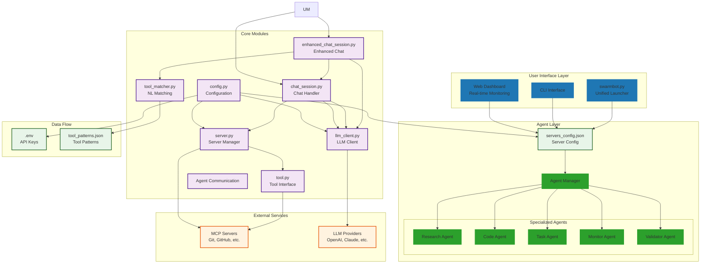

# SwarmBot - Multi-Agent AI System with MCP Integration

SwarmBot is a sophisticated multi-agent AI system that orchestrates collaborative AI operations through specialized agents, dynamic task distribution, and comprehensive real-time monitoring. It seamlessly integrates with multiple MCP (Model Context Protocol) servers, providing access to a wide range of tools through both a unified chat interface and an advanced web-based dashboard.

## 🎯 Key Features

### Core Capabilities
- **Multi-Agent Architecture**: Specialized agents for research, coding, task management, monitoring, and validation
- **Real-Time Dashboard**: Advanced Dash-based web UI for monitoring and controlling the swarm
- **Dynamic Task Orchestration**: Priority-based task queue with dependency resolution and load balancing
- **Agent Communication System**: Point-to-point and broadcast messaging between agents
- **MCP Integration**: Seamless integration with 20+ MCP servers for diverse capabilities
- **Multiple LLM Providers**: Support for OpenAI, Anthropic Claude, Groq, and Azure
- **Automatic Tool Detection**: Natural language understanding for tool selection
- **Comprehensive Monitoring**: Live performance metrics, agent status, and task progress visualization

### Technical Features
- **Unified Launcher**: Single entry point (`swarmbot.py`) with interactive mode selection
- **Secure Configuration**: API keys stored in environment variables
- **Robust Error Handling**: Retry logic and graceful degradation
- **Scalable Architecture**: Configurable agent pools with auto-scaling capabilities
- **Cross-Platform**: Works on Windows, macOS, and Linux

## 📁 Project Structure

```
SwarmBot/
├── src/                        # Core application modules
│   ├── agents/                 # Multi-agent system
│   │   ├── __init__.py
│   │   ├── base_agent.py      # Base agent class
│   │   ├── swarm_coordinator.py # Orchestration engine
│   │   ├── agent_manager.py   # Agent lifecycle management
│   │   ├── communication.py   # Inter-agent messaging
│   │   └── specialized_agents.py # Agent implementations
│   ├── ui/                     # User interfaces
│   │   ├── base.py            # Base UI components (tkinter)
│   │   └── dash/              # Web dashboard
│   │       ├── __init__.py
│   │       ├── app.py         # Dash application setup
│   │       ├── layouts.py     # UI layouts
│   │       ├── components.py  # Reusable components
│   │       ├── callbacks.py   # Interactive callbacks
│   │       └── integration.py # System integration
│   ├── __init__.py            # Package initialization
│   ├── config.py              # Configuration management
│   ├── server.py              # MCP server connection management
│   ├── tool.py                # Tool abstraction layer
│   ├── llm_client.py          # LLM provider interface
│   ├── chat_session.py        # Standard chat session handler
│   ├── enhanced_chat_session.py # Enhanced mode with auto-tools
│   ├── tool_matcher.py        # Natural language tool matching
│   └── logging_utils.py       # Logging configuration
├── tests/                      # Test suite
│   ├── test_config.py         # Configuration tests
│   ├── test_enhanced.py       # Enhanced mode tests
│   ├── test_fixes.py          # Fix verification tests
│   ├── test_minimal.py        # Minimal functionality test
│   ├── test_setup.py          # Setup verification
│   └── run_all_tests.py       # Test runner
├── scripts/                    # Utility scripts
│   ├── launchers/             # Batch/shell launchers
│   │   ├── start_enhanced.bat
│   │   ├── start_swarmbot.bat
│   │   ├── swarmbot_enhanced.bat
│   │   └── dashboard.py       # Dashboard launcher
│   ├── demos/                 # Demo scripts
│   │   └── demo_auto_tools.py
│   └── test_all.bat           # Run all tests
├── docs/                       # Documentation
│   ├── AUTOMATIC_TOOLS_GUIDE.md
│   ├── BASIC_BOT_README.md
│   ├── ERROR_FIXES.md
│   ├── QUICK_REFERENCE.md
│   └── TASKMASTER_GUIDE.md
├── config/                     # Configuration files
│   ├── servers_config.json    # MCP servers configuration
│   └── tool_patterns.json     # Tool matching patterns
├── logs/                       # Application logs
├── swarmbot.py                # 🚀 MAIN UNIFIED LAUNCHER
├── swarmbot.bat               # Windows unified launcher
├── unified_main.py            # Unified entry point (both modes)
├── run_swarmbot.py           # Legacy launcher (redirects)
├── requirements.txt          # Python dependencies
├── REORGANIZATION_SUMMARY.md  # Recent reorganization details
├── WORKFLOW_DIAGRAM.md        # Complete workflow visualization
├── SWARM_ARCHITECTURE.md      # Multi-agent architecture docs
└── .env                      # Environment variables (create this)
```

## 🏗️ Architecture

### Multi-Agent System Overview



For a complete architecture diagram, see [SWARM_ARCHITECTURE.md](SWARM_ARCHITECTURE.md)

## 🚀 Installation

### Prerequisites

- Python 3.8 or higher
- Node.js and npm (for npx-based MCP servers)
- UV (for uvx-based MCP servers)

### Setup Steps

1. **Clone the repository**:
   ```bash
   git clone https://github.com/yourusername/SwarmBot.git
   cd SwarmBot
   ```

2. **Install Python dependencies**:
   ```bash
   pip install -r requirements.txt
   ```

3. **Create environment file**:
   Create a `.env` file in the project root with your API keys:
   ```bash
   # LLM Provider API Keys
   OPENAI_API_KEY=your-openai-key
   ANTHROPIC_API_KEY=your-anthropic-key
   GROQ_API_KEY=your-groq-key
   AZURE_API_KEY=your-azure-key

   # Server-specific API Keys
   GITHUB_PERSONAL_ACCESS_TOKEN=your-github-token
   BRAVE_API_KEY=your-brave-key
   N8N_HOST=your-n8n-host
   N8N_API_KEY=your-n8n-key
   ELEVENLABS_API_KEY=your-elevenlabs-key
   EXA_API_KEY=your-exa-key

   # LLM Provider Selection (optional, defaults to openai)
   LLM_PROVIDER=openai  # Options: openai, anthropic, groq, azure
   ```

## 📖 Usage

### Quick Start

#### Command Line Interface
```bash
# Unified launcher (recommended)
python swarmbot.py              # Interactive mode selection
python swarmbot.py standard     # Start in standard mode
python swarmbot.py enhanced     # Start in enhanced mode
python swarmbot.py auto         # Start in enhanced mode (alias)

# Command-line options
python swarmbot.py --help       # Show help and usage
python swarmbot.py --check      # Check requirements
python swarmbot.py --clean      # Clean log files
```

#### Web Dashboard
```bash
# Launch the web dashboard
python scripts/launchers/dashboard.py

# With options
python scripts/launchers/dashboard.py --host 0.0.0.0 --port 8050 --debug
```

Access the dashboard at http://localhost:8050

#### Programmatic Usage
```python
from src.agents import SwarmCoordinator, AgentManager
from src.ui.dash.integration import SwarmBotDashboard

# Create and run dashboard
dashboard = SwarmBotDashboard()
dashboard.run(host="0.0.0.0", port=8050)
```

### Available Commands

Once SwarmBot is running:
- `help` - Show available commands
- `tools` - List all available tools
- `servers` - Show active MCP servers
- `quit` - Exit the application
- `manual` - Toggle automatic tool execution (Enhanced mode only)

### Multi-Agent System Features

#### Agent Types
1. **Research Agent**: Web research, document analysis, knowledge synthesis
2. **Code Agent**: Code generation, review, refactoring, debugging
3. **Task Agent**: Task planning, distribution, progress tracking
4. **Monitor Agent**: Performance monitoring, error detection, health checks
5. **Validator Agent**: Result validation, quality assessment, compliance checks

#### Dashboard Features
- **Real-time Agent Monitoring**: Live status, load, and reliability metrics
- **Task Management**: Queue visualization, timeline view, priority handling
- **Performance Analytics**: CPU/memory usage, task completion rates, agent utilization
- **Swarm Control**: Agent creation, task submission, configuration management
- **Communication Visualization**: Network graph of agent interactions

### Enhanced Mode Features

Enhanced mode includes intelligent tool detection that automatically selects and executes tools based on natural language:

**Examples**:
- "Show me config.json" → Automatically uses `read_file`
- "What tasks do I have?" → Automatically uses `get_tasks`
- "Search for Python tutorials" → Automatically uses `web_search`
- "What changed in git?" → Automatically uses `git_status`

## 🛠️ Available MCP Servers

### Development Tools
- **mcp-server-git** - Git repository operations
- **github** - GitHub API interactions
- **taskmaster-ai** - Task management and project planning
- **code-reasoning** - Advanced code analysis and reasoning

### Search & Research
- **brave-search** - Web search capabilities
- **exa** - Advanced search and research
- **mcp-server-deep-research** - Deep research capabilities

### Browser & Web
- **puppeteer** - Browser automation
- **browsermcp** - Browser control and interaction

### System & Files
- **desktop-commander** - Desktop file and system operations
- **everything** - Windows file search
- **ripgrep** - Fast file content search

### AI & Automation
- **sequential-thinking** - Step-by-step problem solving
- **mcp-reasoner** - Advanced reasoning capabilities
- **n8n-workflow-builder** - Workflow automation
- **ElevenLabs** - Text-to-speech and voice capabilities

### Data & Storage
- **mcp-server-sqlite** - SQLite database operations
- **memory** - Knowledge graph for persistent memory

## 🧪 Testing

Run the test suite:
```bash
# Run all tests
python tests/run_all_tests.py

# Run specific tests
python tests/test_minimal.py     # Basic functionality
python tests/test_enhanced.py    # Enhanced mode features
python tests/test_fixes.py       # Error fix verification
```

## 🔐 Security

- All API keys stored in environment variables
- No hardcoded secrets in source code
- Secure logging (API keys never logged)
- Input validation for user commands
- Configurable server permissions

## 🐛 Troubleshooting

### Common Issues

1. **Server initialization failures**:
   - Check logs in `swarmbot.log` or `swarmbot_enhanced.log`
   - Verify server command exists (npx/uvx installed)
   - Ensure required API keys are set in `.env`

2. **LLM connection issues**:
   - Verify API key is correct
   - Check API quota/limits
   - Try switching providers via `LLM_PROVIDER`

3. **Tool execution errors**:
   - Check server is properly initialized
   - Verify tool arguments are correct
   - Review server-specific requirements

4. **Verbose logging or console spam**:
   - The logging system filters out non-critical MCP warnings
   - To adjust logging levels, modify `src/logging_utils.py`
   - Check log files for complete debugging information

## 🤝 Contributing

1. Fork the repository
2. Create a feature branch
3. Make your changes
4. Add/update tests
5. Submit a pull request

## 📄 License

This project is licensed under the MIT License.

## 🆕 Recent Updates

- ✅ **Multi-Agent System** - Complete agent architecture with specialized roles
- ✅ **Real-Time Dashboard** - Web-based monitoring and control interface
- ✅ **Agent Orchestration** - Dynamic task distribution and load balancing
- ✅ **Communication System** - Inter-agent messaging and coordination
- ✅ **Fixed MCP notification validation warnings** - Clean console output
- ✅ **Unified launcher system** - Single entry point with `swarmbot.py`
- ✅ Modularized codebase with clean separation of concerns
- ✅ Enhanced mode with automatic tool detection
- ✅ Comprehensive monitoring and analytics

## 📚 Additional Resources

- [Multi-Agent Architecture](SWARM_ARCHITECTURE.md) - Complete system design
- [Automatic Tools Guide](docs/AUTOMATIC_TOOLS_GUIDE.md)
- [Error Fixes Documentation](docs/ERROR_FIXES.md)
- [Quick Reference](docs/QUICK_REFERENCE.md)
- [Taskmaster Integration Guide](docs/TASKMASTER_GUIDE.md)
- [Workflow Diagram](WORKFLOW_DIAGRAM.md) - System workflow visualization
