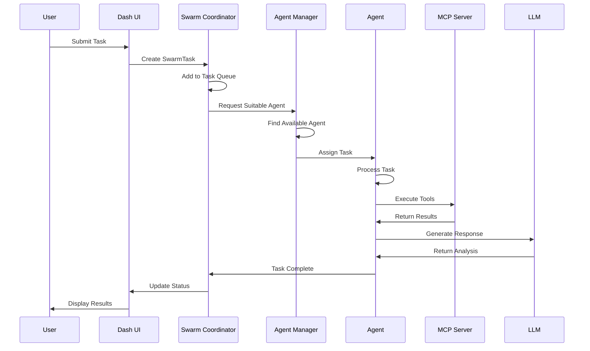
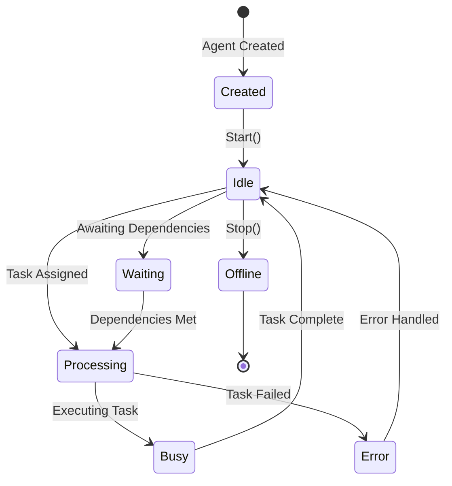
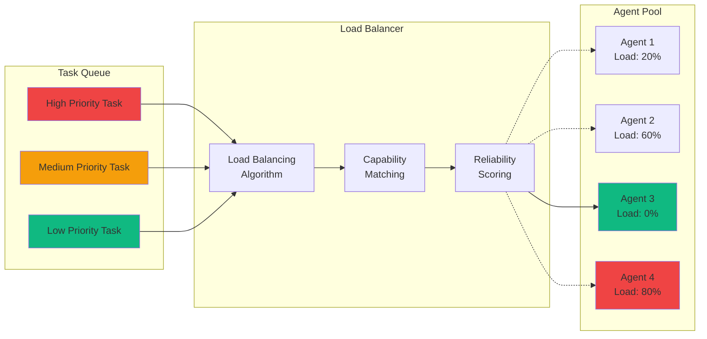
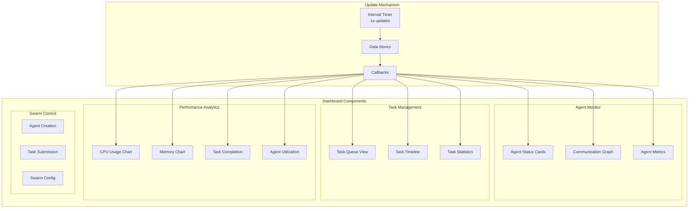

# SwarmBot Multi-Agent Architecture

## System Overview

SwarmBot implements a sophisticated multi-agent system with real-time monitoring and orchestration capabilities. The architecture supports collaborative AI operations through specialized agents, dynamic task distribution, and comprehensive monitoring.

```mermaid
graph TB
    subgraph "User Interface Layer"
        UI[Dash Dashboard]
        CLI[Command Line Interface]
        API[REST API]
    end

    subgraph "Orchestration Layer"
        SC[Swarm Coordinator]
        AM[Agent Manager]
        AC[Agent Communication]
        TQ[Task Queue]
    end

    subgraph "Agent Layer"
        subgraph "Specialized Agents"
            RA[Research Agent]
            CA[Code Agent]
            TA[Task Agent]
            MA[Monitor Agent]
            VA[Validator Agent]
        end
        
        subgraph "Agent Capabilities"
            WR[Web Research]
            DA[Document Analysis]
            CG[Code Generation]
            CR[Code Review]
            TP[Task Planning]
            PM[Performance Monitoring]
            QA[Quality Assessment]
        end
    end

    subgraph "MCP Integration Layer"
        subgraph "Development Tools"
            GIT[mcp-server-git]
            GH[github]
            TM[taskmaster-ai]
            CODE[code-reasoning]
        end
        
        subgraph "Search & Research"
            BS[brave-search]
            EXA[exa]
            DR[deep-research]
        end
        
        subgraph "System Tools"
            FS[filesystem]
            DC[desktop-commander]
            EV[everything]
            RG[ripgrep]
        end
        
        subgraph "AI & Automation"
            ST[sequential-thinking]
            RS[mcp-reasoner]
            N8N[n8n-workflow]
            EL[elevenlabs]
        end
        
        subgraph "Data Storage"
            SQL[mcp-sqlite]
            MEM[memory/knowledge-graph]
        end
    end

    subgraph "Core Services"
        LLM[LLM Client<br/>OpenAI/Anthropic/Groq]
        CFG[Configuration Manager]
        LOG[Logging Service]
        SESS[Session Manager]
    end

    %% User Interface connections
    UI --> SC
    CLI --> SC
    API --> SC
    
    %% Orchestration connections
    SC --> AM
    SC --> AC
    SC --> TQ
    AM --> RA
    AM --> CA
    AM --> TA
    AM --> MA
    AM --> VA
    
    %% Agent Communication
    AC <--> RA
    AC <--> CA
    AC <--> TA
    AC <--> MA
    AC <--> VA
    
    %% Agent Capabilities
    RA --> WR
    RA --> DA
    CA --> CG
    CA --> CR
    TA --> TP
    MA --> PM
    VA --> QA
    
    %% MCP Tool connections
    WR --> BS
    WR --> EXA
    DA --> DR
    CG --> GIT
    CG --> FS
    CR --> GH
    CR --> CODE
    TP --> TM
    PM --> DC
    PM --> EV
    QA --> RG
    
    %% Core services connections
    SC --> LLM
    SC --> CFG
    SC --> LOG
    SC --> SESS
    
    %% Data flow
    TQ --> SC
    SC --> SQL
    SC --> MEM
    
    classDef ui fill:#1f77b4,stroke:#1f77b4,color:#fff
    classDef orchestration fill:#ff7f0e,stroke:#ff7f0e,color:#fff
    classDef agent fill:#2ca02c,stroke:#2ca02c,color:#fff
    classDef capability fill:#d62728,stroke:#d62728,color:#fff
    classDef mcp fill:#9467bd,stroke:#9467bd,color:#fff
    classDef core fill:#8c564b,stroke:#8c564b,color:#fff
    
    class UI,CLI,API ui
    class SC,AM,AC,TQ orchestration
    class RA,CA,TA,MA,VA agent
    class WR,DA,CG,CR,TP,PM,QA capability
    class GIT,GH,TM,CODE,BS,EXA,DR,FS,DC,EV,RG,ST,RS,N8N,EL,SQL,MEM mcp
    class LLM,CFG,LOG,SESS core
```



## Agent Communication Flow



## Agent Lifecycle



## Task Distribution Strategy



## Real-Time Monitoring Dashboard



## Key Features

### 1. **Multi-Agent Architecture**
- Specialized agents for different tasks (Research, Code, Task Management, Monitoring, Validation)
- Dynamic agent creation and management
- Agent capability matching for optimal task assignment

### 2. **Task Orchestration**
- Priority-based task queue
- Dependency resolution
- Load balancing across agents
- Automatic retry mechanisms

### 3. **Communication System**
- Point-to-point messaging between agents
- Broadcast channels for coordination
- Message routing and correlation
- Asynchronous communication patterns

### 4. **Real-Time Monitoring**
- Live agent status tracking
- Task progress visualization
- Performance metrics (CPU, Memory, Response Time)
- Communication network visualization

### 5. **MCP Integration**
- Seamless integration with 20+ MCP servers
- Tool discovery and execution
- Unified interface for diverse capabilities

### 6. **Scalability**
- Configurable agent pools
- Auto-scaling capabilities
- Load distribution algorithms
- Resource optimization

## Configuration

The system supports extensive configuration options:

```json
{
  "swarm": {
    "max_agents": 50,
    "max_retries": 3,
    "task_timeout": 300,
    "load_balancing": true,
    "auto_scaling": false
  },
  "agents": {
    "default_capabilities": ["basic_processing"],
    "reliability_threshold": 0.7,
    "max_concurrent_tasks": 5
  },
  "monitoring": {
    "update_interval": 1000,
    "metric_retention": 3600,
    "alert_thresholds": {
      "cpu": 90,
      "memory": 85,
      "error_rate": 0.1
    }
  }
}
```

## Usage Example

```python
# Create and start the swarm
from src.agents import SwarmCoordinator, AgentManager
from src.ui.dash import create_app, serve_app

# Initialize components
coordinator = SwarmCoordinator()
manager = AgentManager()

# Create agent team
team = manager.create_agent_team({
    "coordinator": {"template_name": "task_coordinator"},
    "workers": [
        {"template_name": "research_specialist"},
        {"template_name": "code_developer"}
    ],
    "specialists": [
        {"template_name": "quality_validator"}
    ]
})

# Register agents with coordinator
for agent in team:
    coordinator.register_agent(agent)

# Start coordinator
await coordinator.start()

# Create and serve dashboard
app = create_app(swarm_coordinator=coordinator)
serve_app(app, host="0.0.0.0", port=8050, debug=False)
```

## Future Enhancements

1. **Advanced Orchestration**
   - Machine learning-based task routing
   - Predictive scaling
   - Multi-objective optimization

2. **Enhanced Communication**
   - Secure agent-to-agent channels
   - Event-driven architectures
   - Message persistence

3. **Extended Monitoring**
   - Historical analytics
   - Anomaly detection
   - Custom alerting rules

4. **Integration Expansion**
   - Additional MCP servers
   - External API integrations
   - Webhook support
